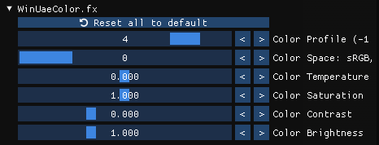

<section class="intro">

**UPDATE 2024-11-22:** Major overhaul of the shaders to more closely mimic the
output of a C= 1084S monitor, plus some other improvements.

- More vivid colours, increased contrast, improved highlights, and better
  gamma ([before1] / [after1]; [before2] / [after2]).
- Interlace support.
- More authentic PAL emulation (less visible scanlines) with reduced moire
  artefacts when using non-integer scaling factors.
- A much easier method to create the scaling factor presets.
- Explanation of the "mystery PAL games" made by Europeans that require NTSC
  strech to appear correctly. Now with concrete examples of deducing the
  perfect aspect ratio for any European release!
{class="compact"}

[before1]: img/elements-of-green-before.jpg
[after1]:  img/elements-of-green.jpg
[before2]: img/king-for-a-day-before.jpg
[after2]:  img/king-for-a-day.jpg

**UPDATE 2023-02-19:** Add section explaining analog RGB, further elaborate my
views on low-resolution "pixel art", plus wording improvements and grammar
fixes.

**UPDATE 2022-11-20:** Shader pack updated to v2, changed the instructions
and screenshots accordingly, plus revised the whole article here and there a
bit. Note that the names of the shader files have changed.

This is a significant update that incorporates Guest's recent shader
improvements, achieves better preservation of highlights, more contrast,
sharpness & vividness, and subtler glow and halation. Enjoy! 😎

</section>



## Preamble

In this article series we'll be looking at emulating the **Commodore 64**,
**Commodore Amiga**, and MS-DOS/early Windows era **IBM PC compatibles** with
period-correct graphics (and maybe a few other classic machines, who knows?).
What do I mean by "period-correctness"? It's quite simple---the emulated
graphics should look as close as possible to the output of CRT displays used
with these computers back in the 1980s and 90s. Now, there's quite a bit of
variance about the most typically used CRT technology per platform, and these
differences matter *a lot*, as will be demonstrated. The below dream
retro-setup showcases the perfect pairings for the aforementioned computers
(no, it's not mine, unfortunately):



  Left: a Commodore 64 paired with a small 13" colour TV. Middle: an Amiga 500
  hooked up to the venerable Commodore 1084 monitor (it's not period-correct if the
  front panel door is *not* broken off!). Right: an IBM PC compatible with a nice
  15" Trinitron display. This Norwegian dude ([UncleAwesome](https://www.youtube.com/channel/UC_Exbgz-zDrEEEaGZmbfA9Q)) certainly knows how to have a good time!
  ([source](https://www.amigalove.com/viewtopic.php?f=11&t=1593&p=10458&hilit=winter#p10458))



Of course, a small percentage of users who used their computers professionally
may have enjoyed bigger and higher quality displays even back then, but here
we're going to be focusing on the experience of the typical home computer
enthusiast (e.g., a kid, not a professional) playing games and watching a few
demos now and then.

In case you're wondering, my "credentials" are having owned these wonderful
systems throughout the late 80s and 90s, and caring deeply about them. I used
to spend far too many hours doing pixel graphics in [Deluxe
Paint](https://en.wikipedia.org/wiki/Deluxe_Paint) on my trusty Amiga 500, got
my feet wet with 3D in
[Imagine](https://en.wikipedia.org/wiki/Imagine_(3D_modeling_software)), and
produced
[countless](https://modarchive.org/index.php?request=view_artist_modules&query=82371)
[modules](https://amp.dascene.net/detail.php?detail=modules&view=2430) (songs)
in [Protracker](https://en.wikipedia.org/wiki/Protracker) and [FastTracker
II](https://en.wikipedia.org/wiki/FastTracker_2), so maybe I'm a bit more
attuned to the accurate emulation of the audiovisual idiosyncrasies of these
classic machines than the average user (or perhaps not---many people who "just
play games" can be very sensitive to these aspects as well). I've also done a
fair bit of VGA programming in assembly on my first 486 PC, so I'm not a
complete stranger to the low-level details of graphics programming either.

In any case, this is not about prescribing the "best" way of emulating these
computers to anybody. "Best" is highly subjective; you can do whatever, for
all I care, and it's not that some friendly agents from the _Bureau of
Historically Accurate Retro-Computing_&trade; will show up at your doorstep
either if you're not following this guide to the letter... However, if you're
after experiencing these systems just like people did back in the day (to the
extent current emulation and display technology allows it)---whether as a
die-hard fan of these iconic machines, or as a newcomer who is interested in
learning more about the glory-days of home computing---I would like to think
you're in the right place. In any case, I do hope you'll find this series a
worthwhile and interesting read.

Finally, while I've been trying to do my best at presenting technically and
historically accurate information in my writings, the more I researched the
topic, the more I realised how much depth and subtlety there is to it. It's
not unlikely that I made a few mistakes here and there, and as there is far
too much misinformation circulating about emulating these systems on the
Internet already, if you've spotted any errors, factual or otherwise, I'd
appreciate if you'd let me know in the comments so I can make the necessary
corrections.

But enough of this lengthy introduction, let's get to one of the best personal
computers of all human history[^c64-amiga]---the mighty **Commodore Amiga!**

[^c64-amiga]: For me, it's a tie between the classic OCS/ECS Amigas and the
  venerable Commodore 64 that just turned 40!



  Commodore Amiga 500 connected to a Commodore 1084 monitor running [Pool of Radiance](https://amiga.abime.net/games/view/pool-of-radiance) ([source](https://www.reddit.com/r/gaming/comments/lyoa9o/my_vintage_commodore_amiga_500_running_dungeons/)). (Note the front panel door of the monitor is broken off here too... Yeah, those things were really flimsy.)



</section>

## The Amiga

In the [Amiga](https://en.wikipedia.org/wiki/Amiga)'s heyday, from the mid-1980s
to early 90s, pretty much everybody who could afford it used their beloved
machine with the iconic [Commodore
1084S](https://dfarq.homeip.net/commodore-1084-monitor/) monitor or a [Philips
CM 8833](https://www.msx.org/wiki/Philips_CM_8833) (most 1084 models were
manufactured by Philips and thus used the same picture tube; they're
essentially identical monitors). Sure, there were other Commodore models and
the 1084 itself had dozens of variations over the years (and so had the
Philips), but they all shared the same [essential
characteristics](https://project64.c64.org/hw/1084s%20Monitor.txt):

- 14" picture tube with a 13" diagonal viewable area
- Slotted-triplet shadow mask (also known as slot mask, or [in-line shadow
mask](https://en.wikipedia.org/wiki/Shadow_mask#/media/File:CRT_pixel_array.jpg))
- 0.42 mm dot pitch
- 15,626 Hz line frequency ([horizontal scan rate](https://en.wikipedia.org/wiki/Horizontal_scan_rate))
- 50/60 Hz image frequency ([vertical scan rate](https://en.wikipedia.org/wiki/Refresh_rate),
  or refresh rate; most models could handle both PAL and NTSC---or
  [RGB 50 and RGB 60](#analog-rgb-vs-tv-standards), to be more exact)
- 600-line vertical resolution
- Composite, Luma-Chroma (almost S-Video, but not quite), digital RGBi, and analog RGB inputs
{class="compact"}

Practically, these were *really* high-quality (for the time) and affordable
small TVs  with analog RGB inputs. As pairing the computer with one of these
monitors is arguably the most authentic classic Amiga experience[^monitors],
we'll be looking at emulating this particular display in
[WinUAE](https://www.winuae.net/), the premier Amiga emulator. Naturally, we
won't care about composite emulation at all---everybody who owned such a
monitor used the much superior RGB input!

The end result is shown below. You can also check out some before/after
images in the [comparison images](#comparison-images) section.



  Amiga Demo by the legendary [Jim Sachs](https://amiga.lychesis.net/artist/JimSachs.html)
  displayed in WinUAE with Commodore 1084S CRT emulation using the correct NTSC
  aspect ratio. (Click on the image to enlarge it so you can appreciate the
  details.)



[^monitors]: Yeah, some poor buggers couldn't afford a monitor and hooked up their
  machine to a TV, but those were either small 13--14" TV sets, or if they
  used the big family TV, that had to be viewed from a distance, so the
  effective image dimensions ended up being about the same (remember, TVs in
  the 80s were *much* smaller than today). The [Sony PVM and
  BVM](http://arekuse.net/blog/tech-guides/bvm-pvm/) line of monitors seem to
  be very much in vogue lately in retro-gaming circles, especially in the US
  because of the almost total lack of small NTSC TVs with SCART inputs over
  there (SCART nearly always give you analog RGB connectivity).  
  I'm sure these Sony monitors are nice, but remember, the P and B stand for
  "Professional" and "Broadcast", respectively. A 20" BVM set you back by
  about 16,000 USD (!) in the 90s, and the smaller models were not exactly
  cheap either, often costing well over a grand. Now, how many home users
  exactly could have afforded these babies back in the day? Zero? I guarantee
  you that no Amiga enthusiast had owned a Sony PVM/BVM *ever* before the year 2000.
  It's just that companies started throwing them away or selling them for $5
  apiece, and the retro crowd quickly snatched them up, creating a small hype
  in the process, so now they command absolutely ridiculous prices on eBay
  again.  
  In any case, as using one of these is not the authentic
  experience (they're too sharp, have aperture masks instead of slots masks,
  and the scanlines are a bit too prominent because of the increased vertical
  resolution of 800--1000 lines), we're not concerned with them here. Another
  fun fact: as Commodore monitors had excellent image quality and colour
  reproduction for the time (for SD broadcast standards, that is), they often
  found their way into professional studios and were sitting next to the
  Sonys. You could buy several of them for the price of a single Sony; there's
  not much arguing with it that they had pretty much the best
  quality/affordability ratio throughout the 80s.

### Analog RGB vs TV standards

Although it's customary to talk about [PAL and NTSC screen
modes](http://oldwww.nvg.ntnu.no/amiga/amigafaq/AmigaFAQ_19.html) on the
Amiga, those are [analog TV broadcast
standards](https://en.wikipedia.org/wiki/Analog_television) and we're dealing
with analog RGB here. There are certainly differences between colours, gamma,
and various image artefacts between PAL and NTSC on
[composite](https://en.wikipedia.org/wiki/Composite_video) and [coaxial RF
(aerial)](https://en.wikipedia.org/wiki/RF_connector) connections, but not on
analog RGB. The only difference between them when connecting the machine to
the [analog RGB
input](https://www.epanorama.net/circuits/vga2tv/rgb_pinouts.html) of a
monitor or a SCART-equipped TV is the vertical refresh rate.

Therefore, the proper names for these "PAL over RGB" and "NTSC over RGB" modes
are **RGB 50** and **RGB 60**, respectively. But I'll just keep using "PAL"
and "NTSC" in this article because they're so entrenched in the popular
vernacular, and that's how these screen modes are referred to in every Amiga
program and the operating system itself as well.

### Single vs double-scan

A significant number of people really dislike the idea of using any kind of
CRT emulation shader, and prefer the look of sharp rectangular pixels when
playing old games on modern flat displays. Well, I used to be one of them so I
know, and if we're talking about emulating 320&times;200 to 640&times;480
(S)VGA games, I wouldn't vehemently disagree (especially on 1080p displays).
Even the cheapest VGA monitors used to be tack sharp, and they exhibited none
of the various effects typically associated with CRT shaders (prominent
scanlines, halation, bloom, etc.)

Moreover, 320&times;200 VGA was double-scanned at a line frequency of 31 kHz
(you can clearly see that on the blown up image below; that's effectively a
640&times;400 image) so you could not really notice scanlines on 15" or even
17" displays from a normal viewing distance, neither the effects of the shadow
mask because of the very fine, typically 0.25--0.28 mm dot pitch. Emulating the
shadow mask would require 8K resolution, and unless you have a 4K display,
you'll have a hard time trying to emulate the subtle scanline effect as well.
On 1080p, it's indeed best to stick with sharp bilinear or integer scaling for
VGA DOS and early Windows games.



  Photo of a typical late 1990s SVGA CRT monitor running Wing Commander at the
  320&times;200 VGA resolution. Virtually all non-broken SVGA monitors
  produced an image this sharp and artefact-free.





  Blown up view of the same 320&times;200 VGA screen---notice that the image
  is double-scanned at 31 kHz. All VGA adapters "2&times; integer upscale" the
  320&times;200 image to 640&times;400 in hardware, and that upscaled image is
  sent from the VGA card to the CRT monitor over the VGA cable. As a result,
  each "320&times;200 pixel" in effectively drawn as a little 2&times;2 pixel
  rectangle at 640&times;400 resolution!



The situation on the Amiga, however, is entirely different. As mentioned,
Commodore monitors were essentially small TVs, subject to SD TV standards. PAL
(NTSC) programmes display 50 (60) half-frames
([fields](https://en.wikipedia.org/wiki/Field_(video))) per second,
interlaced, at 576 (480) lines of vertical resolution. What this means is that
the display alternates between even and odd fields at 50 (60) Hz, and every
field only contains 288 (240) lines, stretched to fill the screen (there is
a one-line vertical offset between the two alternating fields; this is
the cause of the infamous "interlace flicker"). [Interlace](http://amigadev.elowar.com/read/ADCD_2.1/Libraries_Manual_guide/node0316.html) is not that great
with mostly static computer generated images having sharp contours, so for
low-res they used the same trick as most consoles of the era: they simply just
sent the display either all-even or all-odd fields, rather than alternating
between even and odd. The result is a completely static 50 (60) FPS image, but
the scanlines now only have half the "density" vertically, so to speak, which
is the main contributing factor for the famous "scanline" look. Scanlines are
much more noticeable on NTSC because of its ~17% reduced vertical resolution
compared to PAL; this causes the lines making up the image to be placed
further apart (incidentally, this explains why certain forms
scanline-fetishism seem to be more rampant in American retro-gaming circles
nowadays...)

The below photos of Commodore monitors displaying 320&times;200 low-res in
NTSC illustrate single-scanning very well (click on the images to enlarge them
so you can appreciate the details).



  [The Secret of Monkey Island](https://amiga.abime.net/games/view/the-secret-of-monkey-island), 320&times;200 NTSC ([source](https://www.reddit.com/r/crtgaming/comments/jdlr4h/monkey_island_on_a_1084s_in_60hz/))





  Winter scene, 320&times;200 NTSC, 16-colour palette ([source](https://www.amigalove.com/viewtopic.php?f=5&t=2069&p=13621&hilit=winter#p13621))





  [Pinball Dreams](https://amiga.abime.net/games/view/pinball-dreams), 320&times;200 NTSC
  ([source](https://www.amigalove.com/viewtopic.php?f=8&t=1566&hilit=pinball+dreams&start=10))



And this is a video recording of an NTSC Commodore monitor in action from
[AmigaLove](https://www.amigalove.com/) (make sure to watch it in fullscreen).

  <iframe width="560" height="315" src="https://www.youtube.com/embed/b0sVz6hWO68?start=425" title="YouTube video player" frameborder="0" allow="accelerometer; autoplay; clipboard-write; encrypted-media; gyroscope; picture-in-picture" allowfullscreen></iframe>

At 320&times;256 PAL resolution, the pixels are more densely packed together
vertically, and although the scanline effect is weaker, it still subtly
contributes to the overall "textured" quality of the image.



  [Shadow of the Beast](https://amiga.abime.net/games/view/shadow-of-the-beast), 320&times;256 PAL, [too many colours to count](https://codetapper.com/amiga/sprite-tricks/shadow-of-the-beast/). You cannot really discern individual scanlines, but the image definitely has a canvas-like textured quality.





  Protracker running on a PAL Commodore 1084 monitor. Similarly to the
  previous photo, you cannot see scanlines just a subtle texture over the
  whole image.





  Workbench 3.1 running on a PAL Commodore 1084 monitor in 640&times;512 mode.
  The scanlines are very faintly visible, but viewing this zoomed-in image is
  the equivalent of pressing your nose right up to the front glass of the
  screen... You wouldn't see any sign of scanlines under normaling viewing
  conditions (from 1 to 1.5 meters), but they subtly contribute to the "feel"
  of the image.



Essentially, all online flamewars about scanlines versus sharp pixels come
down to which particular systems people participating in the debate owned.

- Guys whose first computer was a PC and grew up with VGA games can rightfully
  claim that they never saw scanlines on their monitors; the pixels appeared
  as sharp, chunky little rectangles.

- PAL Amiga users wouldn't remember any
  scanlines either, but they're certainly not hallucinating either when they
  keep talking the beneficial smoothing effects of CRTs on low-res graphics
  (as Amiga monitors were far less sharp than PC monitors).

- Lastly, Americans who had NTSC Amigas and NTSC consoles, or folks from
  anywhere grewing up with CGA and EGA monitors are right when they claim
  they clearly remember seeing strong, distinct scanlines in their
  games.

### Why bother?

People are paying big money for powerful graphics cards these days to enjoy
their 3D games with smooth antialiased graphics---back in the 80s, we got that
smoothing for free in the monitor hardware on our Amigas! Of course, the
graphics still had to be skilfully made, but if it was properly antialiased by
the artist, the results looked just glorious on a typical Commodore monitor.

Below is an Amiga artwork ran through a CRT shader that simulates the
quintessential Commodore 1084S monitor (click on it for a larger version, and
click again if the cursor turns into a magnifier glass to have it displayed
with 1:1 pixel mapping; this is crucial for all images presented in the
article that demonstrate the shaders). I'd bet that most people could not
correctly guess that this is in fact 320&times;256 / 64-colour pixel art (the
actual image is even smaller; it fits within a 274&times;216 rectangle).
Subjectively, it certainly looks higher resolution than that; there's an
almost 640&times;480 SVGA quality to it. The gradients and the curves appear
super smooth, and you can't see any jagged edges and chunky pixels like you
would on an objectively higher-quality VGA monitor displaying the *exact same*
image!



  [Scarecrow](https://demozoo.org/graphics/67551/) by [Made](https://demozoo.org/sceners/131/) (320&times;256 / 64-colour Amiga AGA pixel art)

  The image was 3&times; upscaled with a CRT shader. Notice on the 200% view
  how the shader melts away all the blockiness, smoothes out the dither
  patterns, increases the perceived resolution, and adds subtle texture to the
  image. None of that is present in the straight 3&times; integer upscaled
  version. That's analog versus digital for you, in a nutshell (emulated
  analog, but still).



What some people don't realise is that you are not really drawing a "mosaic
image" when creating "pixel art" on the Amiga (or any other single-scanline
computer or console intended to be used with a CRT display). The pixel grid is
merely a *control mechanism* for the artist to "command" the electron beam to
perform its analog magic with blending, bloom, glow, and a host of other
CRT-specific artefacts. These "commands" effectively modulate the electron
beam that paints each raster line from left to right, top to bottom, 50 (or
60) times a second, superimposing a little focused speck of light with a
soft-falloff over the fixed phosphor and slot mask patterns. ***There are no
pixels to speak of on a CRT screen!***

Although I'm nowhere near
[the](https://amiga.lychesis.net/artist/JimSachs.html)
[true](https://amiga.lychesis.net/sceners/Made.html)
[pixel](https://amiga.lychesis.net/sceners/Facet.html)[-](https://amiga.lychesis.net/sceners/Archmage.html)[wizards](https://amiga.lychesis.net/sceners/Fairfax.html)
[of](https://amiga.lychesis.net/sceners/Suny.html)
[the](https://amiga.lychesis.net/sceners/Cougar.html)
[Amiga](https://amiga.lychesis.net/sceners/Prowler.html),
I've done a fair bit of pixeling in [Deluxe
Paint](https://en.wikipedia.org/wiki/Deluxe_Paint), and this dichotomy between
the zoomed-in pixel grid and what you actually saw on the unzoomed image on
the CRT was pretty obvious to every artist who didn't completely suck (whether
they consciously realised what they were really doing or not).



  Title picture of the 5th issue of the [Guru
  diskmag](https://demozoo.org/groups/101854/) (a legendary Hungarian-only
  diskmag from the early 90s). The artist (Edvárd Tóth aka
  [Silkie](http://artcity.bitfellas.org/index.php?a=artist&id=2198) of the
  Amiga demo group Cerberos, who was also solely responsible for the stellar art in
  the Amiga-exclusive RPG [Perihelion](http://edvardtoth.com/games/perihelion/)) used the
  320x256 PAL screen mode with a 16-colour palette. This is how the image
  looks with the C= 1084 shader---due to Silkie's masterful
  use of anti-aliasing, you don't see little rectangular "pixels", only smooth
  shapes. This is how well-made "pixel art" looks on a CRT, be it either real
  or emulated!





  Inspecting the above image in Deluxe Paint 3 reveals the peculiar dual
  nature of "pixel art": you can clearly see the rectangular "pixels" on the
  zoomed-in image on the right, but at 1:1 magnification on the left, the
  "pixels" melt away; there are only smooth shapes. I studied this *exact*
  picture for hours in DPaint back in the day; it taught me a great deal about
  effective anti-aliasing techniques, and frankly, it was a revelation. I find
  it best to think about the pixel grid as an abstraction: a control mechanism
  that guides the electron beam to paint a picture with light, as opposed to
  drawing a mosaic image.



So, as we can see, measurable improvements in technical specifications don't
necessarily always translate into better outcomes, especially when human
perception and something as subjective as art is involved. For me personally,
pixel art viewed on Commodore monitors from the 80s is pure magic, and we lost
that during transitioning to the technologically superior, higher-resolution
PC VGA monitors in the 90s. From 1985 to about 1995, a generation of Amiga
artists and enthusiasts had been fixating their gazes upon the flickering
analog magic that was the Commodore 1084S, and that's something I think is
well worth understanding and preserving. And it's just heaps of fun! Using
WinUAE with an emulated 1084S puts me in a good mood every time; although it's
not perfect, it gets me a little closer to the experience of sitting in front
of a real Amiga. And how long until all Commodore monitors finally die and end
up in the junkyard? Like it or not, emulation is the only practical way going
forward.

### Things worth emulating

Having said all that, it's not all roses with analog CRTs. People fondly
remember the visually pleasing aspects of this display technology, but nobody
misses flicker, vignetting, and geometric distortions of the non-flat picture
tubes---just to name the worst offenders. Naturally, we will not be emulating
any of these undesirable elements.

What we *will* be emulating is the following:

- period-correct physical image dimensions and aspect ratio
- electron beam illuminating the phosphors on the screen (versus sharp
  rectangular pixels)
- scanlines (subtly different between PAL and NTSC)
- phosphor and shadow mask patterns
- the characteristic colour reproduction of the Philips picture tube
- bloom, halation, and glow
- interlacing (optionally; it's not for everyone, but it's a cool quirk of the Amiga)
{class="compact"}

We won't be looking at emulating temporal artefacts, such as motion blur and
afterglow, as WinUAE has no support for such effects currently.

Here is a fun experiment on how the shaders hold up against a real Commodore
1084S monitor. The photos were taken from the [Eye of the Beholder
review](https://www.amigalove.com/games.php?game_id=13) published at
[AmigaLove](https://www.amigalove.com/). I highly recommend perusing this site
as it's one of the best online sources of good quality photos of games running
on Commodore monitors (of course, the articles themselves are very
well-written and informative too). Close-up photos of CRTs viewed on LCD
screens don't nearly tell you the whole story, but I'm actually quite
surprised to see the emulated results come this close to the real thing!



  Comparison of real Commodore 1084S monitor photos to the CRT emulation
  presented in this article, and to raw sharp bilinear upscaling. The image on
  the right illustates how most people typically experience the game in WinUAE
  (without a CRT shader and using the wrong PAL aspect ratio---that squashed
  Beholder surely doesn't look too healthy!)





  [Eye of the Beholder](https://amiga.abime.net/games/view/eye-of-the-beholder) with CRT emulation in WinUAE (in correct NTSC aspect ratio, as the developers intended)



That's fine for low-res, but what about hi-res content? There's nothing more
annoying than quitting a game and having to switch the shader off because it
only supports low-res and makes the Workbench screen unreadable. If you're
like me, that will take you right out of your retro-computing bliss in a
jiffy! Fortunately, I have good news for you: the shader we're going to use
supports _all_
[OCS Amiga screen modes](https://amiga.lychesis.net/knowledge/ScreenModes.html)
and therefore looks *glorious* in the 640&times;400 / 640&times;512 hi-res too!



  Workbench 1.3 in all its overscanned NTSC glory. Old school! If this doesn't
  get you excited, I don't know what will. This shader looks so good I want to
  include it in my will, man, I swear!



## A few words about human perception

Before we begin, it's worthwhile to point out that your perception can play
tricks on you, so at the very least, it's good to be aware of a few basic
facts about human perception.

Firstly, we've been conditioned into thinking that *more*, *bigger*, *louder*,
*faster*, etc., always equals *better*. Some of this might be evolutionary,
some just a product of the times we live in, and maybe it's even true most of
the time, but not *always*. It's very easy to outright dismiss an experience
because it seems "inferior" according to some preconditioned criteria, but if
you keep an open mind and try to live with it for a while, you might start to
appreciate some of its not-so-obvious qualities (e.g., a "less sharp" image
could make gradients and dither appear smoother, gently melt away all the
jagged edges, and subjectively might seem more "cosy"---not unlike the certain
magic of technologically inferior (strictly speaking, when looking at specs
and measurements only) old analog recordings versus surgically precise digital
audio reproduction).

Secondly, the _order_ of experiencing things matters. Going from sharp to less
sharp, highly saturated to less colourful, brighter to less bright, louder to quieter, etc., always
feels like "losing something." But look away from your monitor for 10--20
seconds, then look again at the "less sharp" image---wow, now it seems pretty
normal! Switch back to the 100% sharp version---hmm, that's weird; now that
seems too clinical in comparison, and I'm not even so sure anymore if that is
"better"!

As I said, I don't want to suggest to you what your experience should be
exactly (I couldn't really do that, could I?); it's just good to be aware of
these mechanisms, otherwise they can be quite perplexing and could make
you run around in circles.

Because brighter always seems "better", and the CRT shaded output results in
about 10% of brighness loss (unless you're ready to sacrifice the detail of
bright areas by intentionally blowing out the highlights---not something I
would recommend), I have reduced the brightness of the "raw pixels" images to
match that of the CRT shaded output. This is crucial to be able to make fair
comparisons. When you use the shaders, it's best to compensate for the
brightness loss on your physical monitor if this bothers you (more on this
later).

## Credits

The shaders presented in the article are the works of Guest, who originally
published them in the [English Amiga Board](https://eab.abime.net/) forums
(you can read the original discussion
[here](https://eab.abime.net/showthread.php?t=61776)). Since then, he has made
his WinUAE shader pack available on
[GitHub](https://github.com/guestrr/WinUAE-Shaders). Apart from the emulation
of the Commodore A2080 monitor, which I'm going use in this article, the
collection also contains several other interesting things, such as an
arcade CRT shader, and a recreation of the Sony Trinitron displays. They're
certainly all worth a try!

Guest's current bleeding-edge shader-related work can be followed in [this
LibRetro forum
thread](https://forums.libretro.com/t/new-crt-shader-from-guest-crt-guest-advanced-updates/25444).
Although only available for RetroArch/LibRetro at the moment, it's worth
checking out, and we can only hope his work will be eventually ported to
WinUAE in the future (once it has support for more advanced shading
techniques).

## Image dimensions

As explained above, the physical dimensions of an Amiga monitor were
effectively standardised, at least between about 1985--1995. This is important
because if you play games featuring low-res artwork (320&times;256 PAL or
320&times;200 NTSC) designed for 14" CRT screens _fullscreen_ on a 24" or
larger monitor, they will look like crap---everything will look too big and
overly blocky. The best way to experience those old games as their creators
intended is to match the physical dimensions of the emulated computer's image
to that of a 14" monitor. Eerily enough, with 3&times; integer scaling, you
will get almost exactly that on a typical 24" LCD (just draw a 960&times;720
rectangle and measure its diagonal with a ruler; it will be 13", which equals
the diagonal viewable area of the Commodore 1084S).

Now, WinUAE is the greatest Amiga emulator ever, and I absolutely love it, but
I'll be the first to admit that the display settings require _pilot training_.
Things are hunky-dory until all you care about is stretching the image to fill
the whole screen (just use the **Fullscreen (TV)** or **Fullscreen (Max)**
scaling method in the **Filter** section, and set **Aspect Ratio Correction**
to **Automatic**), but once you want to set up *exact* scaling factors and
image dimensions, the UI is not on your side anymore, to put it politely. Long
story short, after countless hours of tinkering, I stumbled upon the *One True
Way&trade;* of getting predictable results in the exact way I wanted, so
that's what I'll describe next.



You don't *need* to set all this up manually if you don't want to; you can
just use the WinUAE configuration file from [my shader pack][shader-pack].
This is what I actually recommend doing. However, these instructions are
educational and necessary if you need to troubleshoot issues or or want to
create your own customised presets.



This is what your **Display** settings should look like. These are the
settings for PAL with no interlacing emulation; we'll tackle NTSC and
interlacing later. Of course, you might want to use windowed mode or a
different vsync method, but the rest must be set *exactly* as shown. Make sure
to use the default settings as your starting point, that's the safest way. The
**Brightness**, **Contrast**, **Gamma**, etc. settings _must_ be at zero,
otherwise they'll screw up things royally when we get to the shader and colour
profile setup later. Ticking the two **Centering** checkboxes surely seems
enticing, but I recommend against it as it will lead to all sorts of problems
when switching resolutions or moving screens vertically (we can always adjust
the image position manually in the **Filter** settings if needed).



  WinUAE Display settings for setting up our CRT shaders



Now the **Filter** settings; again, you must set up everything *exactly* as
shown. With these settings, we'll have full manual control over the scaling
with the **Horiz. size** and **Vert. size** sliders. Unfortunately, the
numerical input boxes are read-only, so we must use the slider widgets to set
the values, which is rather inexact and cumbersome. The only way to make fine
adjustments on the GUI is with the cursor keys while the slider is in focus.
Better yet, just edit the config files directly to set up the correct values,
or download [my shader pack][shader-pack], which contains all the configs you'll need.

With our settings so far, we're getting **2&times; integer scaling** with both
sliders at 0---that's a nice clean starting point. After some trial and error,
I managed to reverse-engineer the formula for any specific scaling factor we
want:

**(ScalingFactor -- 2) &times; 1000**
{class="center"}

So if we want 3&times; scaling, we'll need to set both size sliders to **(3
-- 2) &times; 1000 = 1000**.



  WinUAE Filter settings (3&times; bilinear-sharp scaling)



As I said, 3&times; scaling gives us the authentic C= 1084s image size on a
typical 24" 1920&times;1080 LCD monitor. The rest of the article assumes this
display type, so keep that in mind (you'll need to adjust a few things for 4K
screens---this is an exercise for the reader). [This handy
calculator](https://docs.google.com/spreadsheets/d/1iH8YOhiGvKJ7kZogvKv_aDxkX4688T_VXRFAA2exmJs/edit?usp=sharing)
will help you if you want to adapt my settings to other display size and
resolution combinations.

Sometimes we can deviate from 3&times; scaling with good results. For example,
Pinball Dreams is quite enjoyable at 3.5&times; scaling when leaning back a bit, and I
like to play Rick Dangerous at 3.5&times; or even 4&times; scaling because the game
doesn't use the whole screen. Some games benefit from a slightly larger image,
some don't---you'll need to experiment and use your judgement. In any case,
keep in mind that 3&times; scaling gives you the "canonical" image size
that people were looking at sitting in front of their monitors back in the
day, so that should always be your starting point.



  **Einstein** by [Ra/Sanity](https://demozoo.org/sceners/304/) (from the
  Amiga 500 demo [Arte](https://demozoo.org/productions/5784/)). Proof that
  properly anti-aliased graphics look fabulous at 3.5&times; scaling, too---no
  hints of VGA-style chunkiness anywhere here! Who needs more than 32 colours
  anyway?!



The following table lists some useful scaling factors along with the resulting
image dimensions in pixels, and their equivalent CRT sizes when viewed on a
typical 24" 1080p LCD:

<table>
  <caption>PAL scaling factors (no interlace)</caption>
  <tr>
    <th width="16%">Scaling factor</th>
    <th width="12%">Horiz. size</th>
    <th width="15%">Vert. size</th>
    <th width="12%">Width (px)</th>
    <th width="15%">Height (px)</th>
    <th width="29%">Equivalent CRT size (on 24"/1080p LCD)</th>
  </tr>
  <tr>
    <td>3.0&times;</td>
    <td>1000</td>
    <td>1000</td>
    <td>920</td>
    <td>768</td>
    <td>14" (13.0" viewable)</td>
  </tr>
  <tr>
    <td>3.2&times;</td>
    <td>1200</td>
    <td>1200</td>
    <td>1024</td>
    <td>819</td>
    <td>15" (13.8" viewable)</td>
  </tr>
  <tr>
    <td>3.5&times;</td>
    <td>1500</td>
    <td>1500</td>
    <td>1120</td>
    <td>896</td>
    <td>17" (15.5" viewable)</td>
  </tr>
  <tr>
    <td>4.0&times;</td>
    <td>2000</td>
    <td>2000</td>
    <td>1280</td>
    <td>1024</td>
    <td>19" (17.3" viewable)</td>
  </tr>
</table>

I recommend settings these up as presets so you can conveniently switch
between them (loading a filter preset doesn't restart the emulated machine). The
quick & easy way is to download [my shader pack][shader-pack], open the
included `winuae.ini` file, and copy the contents of the `[FilterPresets]`
section into your own WinUAE config. You'll get this long list of preset shown
below if you do that. Don't worry about the NTSC presets and
"laced" variants just yet; we'll get to them a bit later.

As shown on the filter settings screenshot, if you only want period-correct
scaling but don't care about the CRT shader (in which case you're missing out
a lot, of course, but whatever 😎), you'll need to use the **Point-Prescale**
shader in **slot 0** with both horizontal and vertical oversample factors set
to **4x**.

This will give you sharp-bilinear-like rescaling in low-res modes, but in
hi-res (640-pixel-wide modes) the results will leave a lot to be desired (at
least on 1080p). To fix that, you'll need to use the CRT shader.

## Aspect ratio

[This](https://www.amigalove.com/viewtopic.php?t=348)
[topic](https://www.amigalove.com/viewtopic.php?f=5&t=27)
[has](https://www.gamedeveloper.com/business/no-ms-dos-games-weren-t-widescreen-tips-on-correcting-aspect-ratio)
[already](http://coppershade.org/articles/More!/Topics/Correct_Amiga_Aspect_Ratio/)
[been](https://www.youtube.com/watch?v=zvdNZpHZsO4&t=672s)
[discussed](https://www.youtube.com/watch?v=HSujirmsrzQ)
[to](https://www.youtube.com/watch?v=D5hiwB7lzk8)
[death](https://forums.scummvm.org/viewtopic.php?t=14460)
[a](https://www.reddit.com/r/videogamescience/comments/77c0rp/video_game_history_is_being_distorted_and_how_to/)
[thousand](https://www.neogaf.com/threads/ms-dos-games-and-aspect-ratio.1108226/)
[times](https://www.youtube.com/watch?v=YvckyWxHAIw), but far too many people
still get it routinely wrong. Why's that so, it's a bit of a mystery as the
whole concept is not that difficult to grasp. Here's my stab at explaining it
unambiguously with as few words as possible (but not less!)

### PAL vs NTSC

- Before about 2005, all commonly used consumer TVs and monitors were
  **4:3 display aspect ratio**.

- On **PAL** Amigas, non-interlaced & non-overscanned low-res is **320&times;256**
  and the **pixels are square**[^true-pal-aspect-ratio] (1:1 [pixel aspect
  ratio](https://en.wikipedia.org/wiki/Pixel_aspect_ratio)).
  To display the 5:4 aspect ratio image (320:256 = 5:4) on a 4:3 [display
  aspect ratio
  ](https://en.wikipedia.org/wiki/Aspect_ratio_(image)#Distinctions) screen
  while keeping the pixels square, the image needs to be slightly
  [pillarboxed](https://en.wikipedia.org/wiki/Pillarbox) (it fills the screen
  vertically, but there are two very narrow black borders on the sides, as
  shown on the photo in [this
  article](http://coppershade.org/articles/More!/Topics/Correct_Amiga_Aspect_Ratio/)).[^pal-aspect]

[^true-pal-aspect-ratio]: Yes, I'm aware that the PAL TV standard has 128:117 = 1:1.09402 pixel aspect ratio, so when you hook up your Amiga to a TV, you won't get 100% square pixels. But the difference is very small, and most people used their Amigas with monitors which had horizontal and vertical stretch controls to make the picture fill the screen. Therefore, I'd say this difference is largely irrelevant, and we should should just assume square pixels for all PAL Amiga screen modes for practical reasons.

[^pal-aspect]: It's easy to derive this from the ratios: 4:3 display aspect
  ratio can be rewritten as 16:12, and the [storage aspect
  ratio](https://en.wikipedia.org/wiki/Aspect_ratio_(image)#Distinctions) of
  320:256 = 5:4 as 15:12. Because the vertical ratios are identical, the image
  fills the screen vertically. However, the display is 16 units wide while the
  image width is only 15 units, so there will be black bars on the two sides.

- On **NTSC** Amigas, standard low-res is **320&times;200** (because NTSC has less
  vertical resolution). Because the image fills the screen completely, the **pixels
  need to be 20% taller than wide** (1:1.2 pixel aspect ratio[^true-ntsc-aspect-ratio]). This is commonly
  referred to as "NTSC stretch" in the popular vernacular.[^ntsc-aspect]

[^true-ntsc-aspect-ratio]: Same story as for PAL: the "theoretically correct"
  vertical stretch ratio is not quite 1.2, but close enough so the difference
  does not really matter.

[^ntsc-aspect]: Divide the 320&times;200 NTSC pixel-grid size by ten to get
  the 32:20 [storage aspect
  ratio](https://en.wikipedia.org/wiki/Aspect_ratio_(image)#Distinctions).
  Multiply the 4:3 display aspect ratio by 8 to arrive at the same width
  factor; that will give us a 32:24 display aspect ratio. The horizontal
  factors match, so the image fills the screen horizontally, but not
  vertically, because 24 > 20. To make it fill the screen, we need to stretch
  the image vertically by a factor of 24/20 = 1.2. This makes the pixels 20%
  taller. This is the same vertical stretch factor that must be applied to
  320x200 VGA games so they display correctly on square pixel aspect ratio LCD
  monitors. (Of course, the deeper and true explanation lies in the workings
  of the NTSC broadcast standard and would require some  knowledge of analog
  electronics. However, this purely aspect ratio based
  derivation is sufficient for our purposes.)

The same rationale applies to every other standard [OCS Amiga screen
mode](https://amiga.lychesis.net/knowledge/ScreenModes.html) and their
[overscanned](http://amigadev.elowar.com/read/ADCD_2.1/Libraries_Manual_guide/node0314.html)
variants. The most important thing to remember is that the vertical stretch
factor of NTSC screen modes is *always* 1.2 in relation to their PAL
counterparts, without exception.

This is nothing too controversial so far, is it? PAL users had square pixels
(1:1 PAR), NTSC users slightly tall ones (1:1.2 PAR), and the image always
filled the screen on both standards (not exactly 100%, as explained in the
footnotes, but close enough).

### North American games on PAL computers

Now, certain complications arise from the fact that most NTSC games designed
by Americans (or Canadians), originally intended for the US/Canadian markets,
were also made available in PAL countries (e.g., Europe and Australia). As
early Amigas with the [OCS
chipset](https://en.wikipedia.org/wiki/Original_Chip_Set) were not PAL/NTSC
switchable in software (like later models that had the ["fat" ECS
Agnus](https://theamigamuseum.com/the-hardware/the-ocs-chipset/agnus/), or the
even later [AGA](https://theamigamuseum.com/the-hardware/the-aga-chipset/)
machines that had her successor,
[Alice](https://bigbookofamigahardware.com/bboah/product.aspx?id=1480)), and
many monitors and TV sets supported either PAL or NTSC (but not both), these
PAL conversions had to use PAL screen modes. This usually resulted the
original NTSC graphics occupying the upper 320&times;200 area of a
320&times;256 PAL screen, leaving the bottom 56 lines blank (assuming
low-res). As a result, the art appeared _vertically squashed_ by about 17%
compared to the NTSC original (some people call this the "PAL squash").

Now, what you must understand is that ***these games were made in North America,
on NTSC monitors*** that stretched the 320&times;200 image to fill the whole 4:3
screen! Therefore (whether like it or not) ***everybody on PAL systems
experienced these games incorrectly with the wrong aspect ratio back in the
day*** ("PAL squashed"), ***not*** as the original artists intended!
(Including me, because I grew up in Europe. I'm not an American preaching to
everybody that "Europeans got it all wrong" or something... I'm just simply
stating historical facts.)

Let this sink in a bit.

You must understand that the *only* reason for this rather precarious
situation is the technical differences between PAL and NTSC, and the fact that
drawing the art twice for both systems would have been prohibitively
expensive, so no wonder in 99.9% of the cases this was not done. ***There is
zero artistic intent behind the art appearing squashed vertically by 17% on
PAL ports of American games!*** They just didn't care much because the
cheapest option was not to care.

Now, some people from PAL countries might concur that they only ever
experienced these games with squashed art (and potentially running 17% slower
because of the 60 vs 50 Hz difference); that's how they remember them, and
that's what they want to emulate for nostalgic reasons. It's hard to argue
with that logic, indeed---if those are your memories, then that's the end of
it. But keep in mind the "PAL squash" only happened because of practical
considerations (mainly due to budgetary limitations); it wasn't a deliberate
artistic or creative intention, but an unfortunate necessity. Then the real
question is this: do you want to emulate these games as you remember them, or
how their creators intended them to be experienced? And wouldn't it be nice,
after all these years, to finally enjoy them in their most authentic,
undistorted form?

### It's not just about the video

Many of these PAL conversions were less than perfect and did not account for
the ~17% slowdown that happens when a game synced to the 60 Hz NTSC vertical
refresh rate is running in 50 Hz PAL mode. Quite often, the music playback is
synced to the screen refresh rate, which makes the slowdown fairly
easy to spot (if the game also has a MS-DOS port, one somewhat reliable way
to ascertain the correct music playback speed is to listen to the MS-DOS version.
But this is not a 100% method; sometimes the composers changed the music's
tempo in the ports. Also be careful: just because the music plays at the
supposedly correct speed, it doesn't mean it's OK to run the game in PAL---the
aspect ratio of the graphics is still wrong!)

Check out this video for a demonstration of the PAL vs NTSC differences on the
classic game Secret of Monkey Island. (By the way, it's worth watching the
whole thing from the beginning, it's very informative and enlightening---but
at the very least just watch this little snippet.)

  <iframe width="560" height="315" src="https://www.youtube.com/embed/CYiBDVw_lzA?start=886" title="YouTube video player" frameborder="0" allow="accelerometer; autoplay; clipboard-write; encrypted-media; gyroscope; picture-in-picture" allowfullscreen></iframe>

To cite a few examples of my own, the music plays noticeably slower in the
following American-made games in PAL mode, while in NTSC mode the music speed
matches that of the MS-DOS originals:

- [Eye of the Beholder](https://amiga.abime.net/games/view/eye-of-the-beholder)
- [Eye Of The Beholder II: The Legend Of Darkmoon](https://amiga.abime.net/games/view/eye-of-the-beholder-ii-the-legend-of-darkmoon)
- [Indiana Jones And The Last Crusade: The Graphic Adventure](https://amiga.abime.net/games/view/indiana-jones-and-the-last-crusade-the-graphic-adventure-and-explora-iii-sous-le-signe-du-serpent)
- [Pool of Radiance](https://amiga.abime.net/games/view/pool-of-radiance)[^por]
- [King's Quest II: Romancing The Throne](https://amiga.abime.net/games/view/kings-quest-ii-romancing-the-throne)
- [Space Quest III: The Pirates Of Pestulon](https://amiga.abime.net/games/view/space-quest-iii-the-pirates-of-pestulon) *(probably all Sierra games are affected)*
{class="compact"}

[^por]: Pool of Radiance is an interesting case. The Amiga port was made by a
  European studio, Ubi Soft in France, but clearly it was intended for the
  NTSC market as the graphics need the NTSC stretch to look correct and the
  music plays too slowly in PAL mode.

In some better-coded games that handle both PAL and NTSC correctly, there is
no difference in gameplay or music playback speed (but the aspect ratio is
still wrong, so definitely play these in NTSC):

- [Curse of the Azure Bonds](https://amiga.abime.net/games/view/curse-of-the-azure-bonds)
- [Loom](https://amiga.abime.net/games/view/loom)
- [Phantasie](https://amiga.abime.net/games/view/phantasie)
- [Pirates!](https://amiga.abime.net/games/view/pirates)
- [Secret of the Silver Blades](https://amiga.abime.net/games/view/secret-of-the-silver-blades)
- [Windwalker](https://amiga.abime.net/games/view/windwalker)
{class="compact"}

The moral of the story is that you can rarely go wrong by using NTSC mode
for *all* North American titles (which includes a significant part of the whole
Amiga gaming catalogue). Without a doubt, that's the preferable option; the
graphics will appear undistorted, exactly as the creators intended, and the
game will run at the correct speed, including music playback. (Theoretically,
the only time you can run into problems is when you use a PAL crack of an NTSC
game that somehow breaks NTSC compatibility. But then, it's best not to use
cracks---prefer pristine original dumps whenever possible.)



While online game databases such as [MobyGames](https://www.mobygames.com/)
and [Hall of Light](https://amiga.abime.net/) are certainly very useful
resources, they're not doing their part to promote aspect-ratio correctness.
In fact, their net contribution is negative in this regard, as most of the
screenshots on their websites are in the wrong aspect ratio (99.99% of them
being 1:1 pixel aspect ratio raw captures from emulators, even for games where
that's obviously incorrect; e.g., the vast majority of 320&times;200 DOS
games).

To my knowledge, the maintainers of both websites have been called out about
this issue repeatedly, but they don't seem to care and are generally
uninterested in trying to improve the situation (to be somewhat fair to the
[Hall of Light](https://amiga.abime.net/), that's a website run by Europeans,
and, as I explained, most people on PAL Amigas experienced NTSC games with the
wrong aspect ratio back in the day, so maybe they're doing it "out of
nostalgia"... which is still incorrect for preservation purposes). The same
goes for 90% of gaming related blogs and YouTube videos---they get the aspect
ratio more often wrong than correct.

So take everything you see online with a pinch of salt; we know all too well
how easy it is for misinformation to spread on the Internet. And you know the
saying about billions of flies not being wrong...



### Running games in NTSC

Sadly enough, as Amiga software preservation efforts seem to be almost
exclusively concentrated on PAL releases for whatever reasons, disk images of
NTSC originals are extremely hard to come by. But simply forcing NTSC mode
in the PAL releases widely available online should do the trick in most
cases.

These are the two best ways to do that when using emulation:

- For WHDLoad conversions, forcing a game to run in NTSC mode is as simple as
  adding the `NTSC` tooltype to its launch icon. This will work fine on a
  typical emulated PAL Amiga 1200 setup; the game will open an NTSC screen, and
  WinUAE will automatically apply the correct vertical aspect scaling factor
  *on top* of our manually set PAL scaling. That's good news
  because we don't need to keep switching between PAL and NTSC filter
  presets when playing different games. This method requires the NTSC monitor
  driver to be installed---just drag the NTSC icon from the `Monitors`
  directory on the **Storage** Workbench installer disk to ``Devs/Monitors``
  on your system drive, reboot, and Bob's your uncle!

- If you plan on playing original games on an OCS/ECS Amiga 500 with Kickstart
  1.2/1.3 (a most prestigious choice 🧐), you'll need to emulate an actual
  NTSC chipset. It's very simple: just tick **NTSC** in the **Chipset**
  configuration section. Now, if you turn on automatic aspect ratio management
  in WinUAE (in the **Filter** section select **Fullscreen (TV)** or
  **Fullscreen (Max)** scaling and set **Aspect Ratio Correction** to
  **Automatic**), WinUAE will apply the correct aspect ratio correction right
  from the boot screen. But as I explained previously, this only works if
  you're happy with the image being automatically stretched to fill the whole
  screen. If we want to keep using our exact scaling methods, the automatic
  aspect ratio correction won't work. The solution is to incorporate the NTSC
  stretch into our vertical scaling factor (**Vert. size**) as shown below:

<table>
  <caption>NTSC scaling factors (no interlace)</caption>
  <tr>
    <th width="16%">Scaling factor</th>
    <th width="12%">Horiz. size</th>
    <th width="15%">Vert. size</th>
    <th width="12%">Width (px)</th>
    <th width="15%">Height (px)</th>
    <th width="29%">Equivalent CRT size (on 24"/1080p LCD)</th>
  </tr>
  <tr>
    <td>3.0&times;</td>
    <td>1000</td>
    <td>1600</td>
    <td>920</td>
    <td>720</td>
    <td>14" (13.0" viewable)</td>
  </tr>
  <tr>
    <td>3.2&times;</td>
    <td>1200</td>
    <td>1840</td>
    <td>1024</td>
    <td>768</td>
    <td>15" (13.8" viewable)</td>
  </tr>
  <tr>
    <td>3.5&times;</td>
    <td>1500</td>
    <td>2200</td>
    <td>1120</td>
    <td>840</td>
    <td>17" (15.5" viewable)</td>
  </tr>
  <tr>
    <td>4.0&times;</td>
    <td>2000</td>
    <td>2800</td>
    <td>1280</td>
    <td>960</td>
    <td>19" (17.3" viewable)</td>
  </tr>
</table>

For the horizontal size, our formula is the same:

**(ScalingFactor -- 2) &times; 1000**
{class="center"}

For the vertical size, we need to take the 1.2&times; "NTSC stretch" into account:

**(ScalingFactor &times; 1.2 -- 2) &times; 1000**
{class="center"}

I recommend having NTSC scaling presets as well so you can easily switch
between them at will. Again, just download [my shader pack][shader-pack] and
you'll get a comprehensive set of NTSC filter presets as well; you won't need
to set up anything.

### European releases

Surely, we can put this whole PAL vs NTSC fiasco behind us now, right?

Riiiight?

Sorry, bud. Life ain't that simple.

The situation with European-made games is a bit more complicated. We have the
"true PAL" and "true NTSC" games, but there's also a weird hybrid category:
games that require NTSC stretch for the graphics to look correct, but also 50
Hz PAL timings. We'll use the _only slightly awkward_ **NTSC50** name for this
category[^ntsc50].

[^ntsc50]: Technically, some of these European-made games might work on a
true NTSC machine as well. You can certainly try, but the safe bet is to
stay on a 50 Hz PAL machine and just apply the NTSC stretch via the filter
settings. And, of course, if the music plays faster in NTSC mode, just
stay with PAL.

Okay, so the complete algorithm for determining whether a particular title should be
played in **PAL**, **NTSC**, or **NTSC50** is as follows:

- **Games originally developed by North American studios**

  **Always use NTSC** for European releases of games originally made by Americans.
  It does not matter if the European PAL version was made by a European
  developer; in virtually all cases they just reused the original NTSC
  graphics assets, and quite often didn't even attempt to address the 17%
  slowdown issue.

  *Some well-known North American studios: Activision, Accolade, Electronic Arts,
  Westwood, Origin, Interplay, FTL, MicroProse / MPS Labs, SSI,
  Lucasfilm Games / LucasArts, Sierra, Cinemaware, New World Computing,
  Sir-Tech, Infocom, Access Software, Electric Dreams, Spectrum Holobyte,
  Epyx, D.S.I., U.S. Gold, Broderbund, Capcom, SEGA*

- **Games originally developed by European studios**

  We have three subcategories here:

    *  **"True" PAL games** — If the game uses **320&times;256** or some other
       PAL screen mode, and the graphics fill the whole screen---**always use
       PAL.** Some games even make good use of overscanned PAL modes; that's
       also a dead giveaway that the game cannot possibly work on an NTSC
       Amiga (e.g., [Pinball Dreams](https://amiga.abime.net/games/view/pinball-dreams),
       [Exile (OCS)](https://amiga.abime.net/games/view/exile),
       [Stardust](https://amiga.abime.net/games/view/super-stardust),
       [Agony](https://amiga.abime.net/games/view/agony),
       [The Settlers](https://amiga.abime.net/games/view/the-settlers)).

       If the graphics only takes up a **320&times;200** or smaller area of
       the 320&times;256 screen, leaving a black bar at the bottom (or both
       the top and the bottom if they bothered to centre the graphics), that
       does *not* automatically mean the game needs NTSC stretch to look
       correct; the graphics might have been drawn with square pixels in mind.
       [Perihelion](https://amiga.abime.net/games/view/perihelion-the-prophecy)
       (developed by two Hungarian teenagers!) is a good case in point: the
       graphics is 320&times;200, but it assumes square pixels. Other notable
       examples include
       [Lemmings](https://amiga.abime.net/games/view/lemmings),
       [Fate: Gates of Dawn](https://amiga.abime.net/games/view/fate-gates-of-dawn),
       [Legend of Faerghail](https://amiga.abime.net/games/view/legend-of-faerghail),
       [Knightmare](https://amiga.abime.net/games/view/knightmare-mindscape),
       and [Rick Dangerous](https://amiga.abime.net/games/view/rick-dangerous).

       These developers probably just wanted to play it safe for an eventual
       future North American release, but at the same time, they put their
       European audience first.

    *  **Atari ST ports** — Atari ST ports hit the Amiga market by the
       truckload in the early Amiga days. It was a low-effort way to earn
       some quick bucks because the two machines use the same Motorola 68000
       CPU, so most early Amiga games were in fact Atari ST ports. Both PAL
       and NTSC Atari ST machines use 1:1.2 pixel aspect ratio in their
       320&times;200 screen mode, just like NTSC Amigas. Therefore, Atari ST
       ports always need the NTSC stretch for the graphics to look as
       intended, and if the game is European made, that puts it into the
       **NTSC50** category (because the game might rely on 50 Hz PAL
       timings). The Atari ST was quite popular in Europe (a lot more than in
       the US), so most Atari ST ports were made by European studios.

       The situation is clear-cut when the Atari ST original came out a year
       or two earlier than the Amiga port, but it gets fuzzy with
       _simultaneous_ multiplatform releases. Fear not, we'll tackle these in
       the next subcategory.

       For example, [Midwinter](https://amiga.abime.net/games/view/midwinter)
       was released in 1989 for the Atari ST, then the Amiga and MS-DOS ports
       appeared in 1990 on the shelves
       ([source](https://www.mobygames.com/game/1479/midwinter/)). [Box
       scans](https://amiga.abime.net/games/view/midwinter#scans) of the
       European releases and all European adverts feature NTSC aspect ratio
       screenshots, so this is an NTSC50 game.

    *  **Multiplatform releases** — If the game was released simultaneously
       for the Amiga and one or more other platforms (typically Atari ST or
       MS-DOS), things can go either way based on developer preference.

       Since the Atari ST and IBM PC compatibles always have 1:1.2 PAR ("NTSC stretched"
       pixels) in the most common 320&times;200 screen mode, some developers
       went with assuming NTSC stretch for the graphics. A sensible choice, as
       that maximises the number of people experiencing the game in the
       correct aspect ratio across all supported platforms... except for PAL
       Amigas, where you'd get a slightly squashed image.

       Then some other developers prioritised PAL Amigas for their
       multiplatform releases, and screw the rest! :sunglasses: Being
       Europeans (and most likely avid Amiga enthusiasts themselves),
       you can't fault them for wanting to present their game in the best
       light to their fellow PAL Amiga users. The drawback of this approach is
       that the re-used graphics would appear slightly tall (vertically
       stretched by 20%) on the rest of their supported platforms, which
       typically includes NTSC Amigas, Atari ST, and IBM PC
       compatibles.[^other-platforms]

       [^other-platforms]: But what if the game also came out on the Commodore 64, ZX
       Spectrum, Amstrad CPC, BBC Micro, etc.? These 8-bit computers had vastly
       different and much more modest graphical capabilities compared to the
       leading 16/32-bit platforms of the era (Amiga, Atari ST, and IBM PC
       compatibles), so usually a different artist would re-create the art from
       scratch for the 8-bit computers. Same goes for 8-bit to 16-bit conversions;
       the art was redrawn with more colours, often at a higher resolution in
       virtually all cases.

           The graphics would be typically only reused between the 16/32-bit
           platforms as follows:

           - Create the graphics with Atari ST limits
             (16-colour palette out of 512 possible colours), then simply re-use it on the
             Amiga and the PC.

           - Create the graphics with Amiga limits (typically
             16/32/64-colour palette out of 4096 possible colours), then re-use
             it on the PC (assuming a VGA adapter), and downconvert for the
             Atari ST.

           - Create the graphics with VGA limits (256-colour palette out of 16
             million possible colours), then downconvert for the Amiga and
             Atari ST (hopefully manually---hello, Sierra?!).

       *A few important European studios: Bitmap Brothers, Psygnosis, Bullfrog,
       Horror Soft / Adventure Soft, Magnetic Scrolls, Delphine, Coktel Vision,
       Revolution, Ubisoft, Infogrames, DMA Design, Core Design, Level 9, Team 17,
       Sensible Software, Firebird, Digital Illusions, Silmarils, Thalion,
       Thalamus, Ocean*

       It should be pretty clear at this point that you need to put in some
       research for every single European title to be sure. Here are a few
       examples that showcase the thought process going into determining the
       correct settings:

       - [Elvira: Mistress of the Dark](https://amiga.abime.net/games/view/elvira-mistress-of-the-dark) —
         Simultaneous Amiga, Atari ST and MS-DOS release in 1990
         ([source](https://www.mobygames.com/game/4050/elvira/)). The
         screenshots have NTSC stretch on both the UK and US
         [box art](https://amiga.abime.net/games/view/elvira-mistress-of-the-dark#scans).
         The human figures, faces, and some interface elements look squashed
         in PAL mode, so this is an **NTSC50** title.

       - [Boston Bomb Club](https://amiga.abime.net/games/view/boston-bomb-club) —
         Simultaneous Amiga, Atari ST and MS-DOS release in 1991 ([source](https://www.mobygames.com/game/7704/boston-bomb-club/)).
         The title screen needs NTSC stretch to look as on the [box
         art](https://amiga.abime.net/games/view/boston-bomb-club#scans). The
         in-game graphics, although abstract, also look squashed without
         NTSC stretch. Another fine **NTSC50** example.

       - [International Karate+ (IK+)](https://amiga.abime.net/games/view/ik-plus) —
         The Commodore 64 and ZX Spectrum originals came out in 1997, then the
         Amiga and Atari ST ports in 1998
         ([source](https://www.mobygames.com/game/7471/chop-n-drop/)). The
         European [box art](https://amiga.abime.net/games/view/ik-plus#scans)
         features NTSC screenshots, the in-game IK+ logo needs NTSC strech to
         look as on the box, and the contestants appear way too stumpy in PAL
         mode. Definitely needs **NTSC50**.

       - [Ishar 3: The Seven Gates of Infinity](https://amiga.abime.net/games/view/ishar-3-the-seven-gates-of-infinity) — Simultaneous Amiga, Atari&nbsp;ST, MS-DOS, and Macintosh release in 1994
         ([source](https://www.mobygames.com/game/1003/ishar-legend-of-the-fortress/)).
         Human figures and the circles only look correct with NTSC stretch,
         and Silmarils are known to consistently favour NTSC stretch (1:1.2
         PAR) in their muliplatform titles. The situation is the same for the
         other two installments of the [Ishar series](https://amiga.abime.net/games/list/?gamename=ishar).
         **NTSC50**, next please.

       - [Captain Blood](https://amiga.abime.net/games/view/captain-blood) ---
         Simultaneous multiplatform release on no less than seven (!) platforms in 1988,
         including Atari ST, Amiga, and MS-DOS. The screenshots on the
         European [box art](https://amiga.abime.net/games/view/captain-blood#scans) clearly
         indicate NTSC stretch is required, and we know this game was
         developed on the Atari ST (and that the Atari ST original is
         superior). **NTSC50** it is.

       - [Speedball 2: Brutal Deluxe](https://amiga.abime.net/games/view/speedball-2-brutal-deluxe) —
         Simultaenous Atari ST and Amiga release 1990, MS-DOS port in 1991
         ([source](https://www.mobygames.com/game/273/speedball-2-brutal-deluxe/)).
         Both the European and US [box art](https://amiga.abime.net/games/view/speedball-2-brutal-deluxe#scans)
         feature PAL screenshots. No
         wonder because there are *lots* of circles in the game that look like
         ovals in NTSC. That's a good indicator, but what really seals the
         deal is that the human figure's proportions only look correct in PAL
         mode in the team management screen. No doubt, the art was created
         assuming square pixels (1:1 PAR), so we'll go with **PAL**.

       - [Powermonger](https://amiga.abime.net/games/view/powermonger) —
         Simultaneous Amiga and Atari ST release in 1990, then an MS-DOS port
         in 1992 ([source](https://www.mobygames.com/game/1993/powermonger/)).
         Both the European and US [box art](https://amiga.abime.net/games/view/powermonger#scans) and adverts feature PAL
         screenshots, the human figures look too tall with NTSC
         stretch, and the circular stopwatch in the bottom left corner of the
         in-game screen is yet another minor clue. Definitely **PAL**.

       - [Populous](https://amiga.abime.net/games/view/populous) —
         Simultaneous Amiga, Atari ST, and MS-DOS release in 1989
         ([source](https://www.mobygames.com/game/613/populous/)). We know
         Peter Molyneaux developed this on his [effectively stolen Amiga 1000
         machines](https://www.gamespot.com/articles/molyneux-on-building-populous/1100-6302263/#:~:text=What%20he%20talked,10%20Amiga%201000s.%22),
         so it's reasonable to assume the game needs square pixels to look as
         intended. But the screenshots are in PAL on the European [box
         art](https://amiga.abime.net/games/view/populous#scans) and in NTSC
         on the US box, so whatever---flip a coin. It's an abstract game (and
         there are no circles) so it really doesn't matter much. I prefer
         **PAL** because it's a European game.



  [Perihelion: The Prophecy](https://amiga.abime.net/games/view/perihelion-the-prophecy) (PAL, 3&times; scaling) 
  A "true PAL" Amiga-exclusive game that uses the top 320&times;200
  area of the 320&times;256 PAL mode but assumes square pixels.





  [Ishar 3: The Seven Gates Of Infinity](https://amiga.abime.net/games/view/ishar-3-the-seven-gates-of-infinity) (NTSC50, 3&times; scaling) 
  European-made game that needs NTSC stretch to look correct (1:1.2 pixel aspect ratio).





  [Captain Blood](https://amiga.abime.net/games/view/captain-blood) (NTSC50, 3&times; scaling) 
  European-made Atari ST port that assumes NTSC stretch (1:1.2 pixel aspect ratio).





Although looking at circles and squares to determine the intended aspect ratio
may help in some cases, it is _not_ a 100% fool-proof method!

While getting the circles right certainly works for
most racing games and flight simulators featuring lots of circular gauges,
in general, it's better to look at common everyday objects and make sure they
appear correctly---neither too tall nor too squashed. Getting human faces and
full human figures right is your best bet. Common objects that should be
square, such as floppy disks, could also give you some hints, but the
situation is similar to circles---if a certain aspect ratio setting makes the
human figures look right but the floppy icon slightly non-square, then so be
it. Ignore the floppy icon; you're done.

I like to use the "circle test" as an additional extra clue or reassurance
rather than a major deciding factor. Making in-game art look like what you see
on the box cover is generally much more fruitful than fixating on 100% correct
circles and squares. Just get that and the human figures right, and let the
circles and squares fall where they may.

_Yeah, don't trust the circle, man; he's a lying son of a bitch! Its
good-for-nothing pal, the square, is no better either!_ :sunglasses:

Same deal with getting all "45-degree diagonals" in low-res pixel art "right".
It's very enticing for those with even just mild OCD tendencies, I get it. But
leave them be; they aren't reliable reference points. Even in 100%
confirmed NTSC games, artists routinely used the typical "stairstep" pixel-pattern
to approximate 45-degree lines, which is of course not exactly 45 degrees with 1:1.2
PAR. Hitting the _exact_ 45-degree angle is just not really viable at low
resolutions with non-square pixels, so they took this close-enough compromise
that results in crisp diagonal lines.



## CRT shader

Congratulations on making it so far; now the display of your emulated Amiga
should resemble that of a PC VGA monitor in low-res mode (sharp blocky pixels
and all). But unlike VGA, which is double-scanned at a horizontal sync
frequency of 31 kHz, all stock Amigas output 15 kHz single-scanned video
signals[^a3000], and not even the best Commodore monitors could enter the ring
against any average 14" VGA display from the 90s when it comes to sharpness
(unsurprisingly, since the IBM PC was originally intended as a business
machine, therefore text legibility was of primary concern).

[^a3000]: Except for the [Amiga 3000](https://en.wikipedia.org/wiki/Amiga_3000),
which includes a scan-doubled 31 kHz VGA output connector as well.

To simulate the roundish "pixels" of the 1084S that slightly blend into each
other (a rather nice "natural anti-aliasing" effect that makes low-res artwork
much more pleasant to look at and lends the image this wonderful "fuzzy
analog quality") and the subtle scanlines (at least on PAL; on NTSC they're
much more prominent), we'll need Guest's rather excellent
**CRT-A2080-HiRes-SmartRes-Interlace** CRT shader. This shader is the star of
the show, and this makes the biggest difference after matching the physical
image dimensions of the 1084S monitor. One of its most remarkable features is
that it has seamless support for all OCS Amiga screen modes in a *single*
shader (320&times;256 Low Res, 640&times;256 High Res, 320&times;512 Low Res
Laced, 640&times;512 High Res Laced, and naturally all their overscanned and
NTSC variants). This thing handles _everything_ you throw at it, including
low-res/hi-res split-screen games (e.g., [Lemmings](https://amiga.abime.net/games/view/lemmings),
[Shadow of the Beast](https://amiga.abime.net/games/view/shadow-of-the-beast),
[Apidya](https://amiga.abime.net/games/view/apidya),
[Agony](https://amiga.abime.net/games/view/agony),
all [Magnetic Scrolls](https://amiga.abime.net/games/list/?developer-id=368) adventures, etc.)



  Start scene of [Scapeghost](https://amiga.abime.net/games/view/scapeghost) by [Magnetic
  Scrolls](https://en.wikipedia.org/wiki/Magnetic_Scrolls). The upper half of the
  screen is 320&times;256 low-res, while the bottom
  half displaying the text is 640&times;256 hi-res. As you can see,
  **CRT-A2080-HiRes-SmartRes-Interlace** handles situations like this
  splendidly! I love you, **CRT-A2080-HiRes-SmartRes-Interlace**! ❤️



(By the way, in case you're wondering, "the Commodore A2080 was essentially a
high persistence phosphor model of the 1084 to reduce flicker in NTSC modes",
according to the [Big Book of Amiga
Hardware](https://bigbookofamigahardware.com/bboah/product.aspx?id=864).)

I have tweaked the shader settings a little bit, you can get the updated
shaders by downloading [my shader pack][shader-pack]. They’re called
**CRT-A2080-PAL**, **CRT-A2080-PAL-Sharp** and **CRT-A2080-NTSC**. I had to
create three copies because WinUAE doesn’t support shader presets yet.

Why do we need three different presets? The scalines are more densely packed
in PAL modes, so I had to tweak the scanline strength of the **CRT-A2080-PAL**
shader to reduce interference artefacts (moire patterns) at non-integer
scaling factors on 1080p screens. This is much less of a problem on higher
resolution displays (1440p, 4K, or higher) ---on these screens, you can
probably get away with using **CRT-A2080-NTSC** for everything, including PAL
modes.

The **CRT-A2080-PAL-Sharp** variant maximises horizontal sharpness for
increased text legibility. You might want to use this for adventure games
featuring 80-column text, but for general low-res gaming, this makes the image
a bit _too_ sharp which reduces the beneficial "natural anti-aliasing" effects
of the CRT emulation. Interestingly, the less densely packed NTSC scanlines make
the image look subjectively sharper, so I did not see the need for creating a
"sharp NTSC" variant as well.

Lastly, the **CRT-A2080-NTSC** preset has stronger, more distinct scanlines.
It is safe to use at 1080p with non-integer scaling factors because the
scanlines are spaced further apart due to the "NTSC stretch", so you won't get
any moire. Of course, if you want softer scanlines, you can always simply
just use the PAL preset for NTSC video modes as well. Commodore had
[a vast range of CRT monitors](https://gona.mactar.hu/Commodore/monitor/Commodore_monitors_by_model_number.html)
available back in the 80s, so naturally some were a bit less sharp, making
this a valid choice that's still rooted in reality.

Okay, so this is how to set up the CRT shaders:

* In the **Miscellaneous** section, select **Direct3D 11** and **Hardware
  D3D11** (quite confusingly, these are right under the _Windowed style_
  drop-down). *Do not use Direct3D 9* as that will result in uneven
  scanlines for some reason.

* Put the `CRT-*.fx` shader files into ``plugins\filtershaders\direct3d`` in
  your WinUAE installation directory and restart WinUAE.

* In the **Filter**
  section, select one of the **CRT-*** shaders in slot 0, and set 2x
  horizontal and 4x vertical oversampling. If you have a slower GPU and
  you're getting dropouts, you might want to reduce this a little, but don't
  go below 3x vertical oversampling (this is essential to make the scanlines
  look even and interference-free; 1x horizontal and 3x vertical is the
  recommended minimum). Oversampling takes a big hit on performance; e.g.,
  with 2x horizontal and 4x vertical oversampling, your GPU would need to
  perform 2&times;4=8 times more work!

Detail view of the NTSC variant in action on a scene from [Defender of the
Crown](https://amiga.abime.net/games/view/defender-of-the-crown):



  Left: sharp-bilinear scaling (NTSC aspect ratio corrected) 
  Right: **CRT-A2080-NTSC** shader





3.2&times; scaling with the PAL shader is especially prone to showing vertical
interference artefacts (moire patterns) on large areas filled with a solid
colour. These artefacts are more pronounced with certain colours than others;
you can see it very clearly on fade ins and fade outs as those effects cycle
through a wide range of colours (e.g., when some intro graphics with a full
white background fades to black).

There's not much to do about this; this is just a side-effect of using
non-integer scaling factors at 1080p. If it really bothers you, either use
3.5&times; scaling with the PAL shader (which greatly mitigates these
artefacts), or simply restrict yourself to 3.0&times; or 4.0&times; scaling
(which 100% eliminate them). Alternatively, buy a 4K monitor, then you can
freely use pretty much any non-integer scaling factor and never have to worry
about moire patterns.

The NTSC preset is not affected as NTSC scanlines are spaced a bit further
apart, which prevents such interference patterns from developing.



### CRT colour profile and monitor controls

The next thing that will make a huge difference in replicating an authentic
CRT experience is emulating the colour profile of the Commodore 1084S monitor.
Most modern displays are calibrated for
[sRGB](https://en.wikipedia.org/wiki/SRGB) out-of-the-box which uses
the [D65](https://en.wikipedia.org/wiki/Illuminant_D65) (6500K) white point. This
is noticeably cooler (bluer) looking than the more warmish/yellowish look of a
typical CRT from the 80s, which was closer to 5000K (CRT manufacturers more or
less just did whatever they felt like back then; the [sRGB
standard](https://en.wikipedia.org/wiki/SRGB) came into existence in 1996
precisely to remedy this Wild West type of situation).

Guest's [WinUAE shader pack](https://github.com/guestrr/WinUAE-Shaders)
contains a CRT colour profile filter in ReShade format
([ReshadeShaders/WinUaeColor.fx](https://github.com/guestrr/WinUAE-Shaders/blob/master/ReshadeShaders/WinUaeColor.fx)),
and one of the included profiles is exactly what the doctor ordered
(information about the different profiles can be found
[here](https://github.com/guestrr/Libretro-Retroarch-SLANG/blob/main/crt-guest-dr-venom2/shaders/guest/README#L242-L360=)):

> **[Profile 4]** Manually calibrated and compared to real Philips based CRT
> monitors, running side by side with the shader on a 10-bit DCI-P3 gamut
> panel. This calibrated CRT profile covers amongst others Philips CM8533,
> Philips VS-0080, and Commodore 1084.
>
> Note the whitepoint is significantly different from D65. It's closer to
> 6100K, but clearly not on the blackbody curve.

Perfect! You'll need to install [ReShade](https://reshade.me/) into your
WinUAE folder to use this, just follow Guest's instructions from the
[README](https://github.com/guestrr/WinUAE-Shaders/blob/master/README.md). Now
one thing that he doesn't mention is that the shaders depend on the common
**ReShade.fxh** and **ReShadeUI.fxh** files that are not included, so just get
them from [here](https://github.com/crosire/reshade-shaders/tree/slim/Shaders)
(all these files are included in [my preset
pack][shader-pack], by the way).

The **WinUaeColor** filter also implements brightness, contrast, and
saturation monitor adjustment controls. So I've done some customisations to
make things a bit more user friendly: I've created two copies of
**WinUaeColor** under the names **MonitorControls** and **ColorProfile** and
have exposed only the relevant controls in each plugin in the ReShade UI. I've
also renamed **WinUaeMaskGlowAdvanced** to **MaskAndGlow**. You know the
drill, get these modified versions from my preset pack. Our final ReShade
filter chain should then look like this:

* MonitorControls 
* ColorProfile 
* MaskAndGlow
{class="compact"}

Once you've set up everything correctly, enable **MonitorControls** and
set it up as shown below.

Everything should be left at their default values, except for **Color
Contrast** which I like to set to about 0.300 as my default setting. You can
adjust it to taste later but this is a good starting point. Some
games look quite nice with the contrast cranked up almost to the max, while
some look completely fine at near zero---just like on real hardware.

**Colour Temperature** should always stay at zero. You can bump up **Color
Saturation** a little bit if you want, but try to be gentle as it's very easy
to overdo it. Generally, try not to go above 1.100.

Later on, you might want to increase **Color Brightness** to compensate for
the brighness loss introduced by the CRT shaders, but
that will inevitably lead to some loss of detail in the highlights. It's much
better to increase the contrast on you monitor instead, but more on this
later.

The next thing is to enable **WinUaeColor.fx** as the second filter in
the chain. **Color Profile 4** is the Philips, most people
should leave **Color Space** at 0 (sRGB), but if you're the lucky owner of a
wide-gamut display, then you should definitely set it to match your display's
colour profile (the emulation would be more accurate that way, according to
the instructions). Leave all the other controls at their default neutral
settings---as I explained, we're using this second instance only for
emulating the monitor's colour profile.

As expected, the right half of the below example image with the Philips colour
profile applied looks much warmer and cosier. Now we're cooking on gas! ---
this is how I remember my Philips and Commodore monitors, the raw sRGB version
looks too harsh and clinical in comparison.



  Left: a scene from [Centurion: Defender of Rome](https://amiga.abime.net/games/view/centurion-defender-of-rome) by Jim Sachs, sRGB colours 
  Right: the same image with the Philips colour profile applied



The difference is even more striking on greys, like on this Directory Opus
screenshot:



  Left: Directory Opus, sRGB colours 
  Right: same image with the Philips colour profile



### Phosphor and shadow mask

The next step is subtle but important: the emulation of the phosphor pattern
and the shadow mask that gives the image a subtle, almost canvas-like texture.
Different monitors use different types of [shadow
masks](https://en.wikipedia.org/wiki/Shadow_mask); the 1084S and most early
computer monitors have the slot mask or in-line type which was also
commonly used in TV CRTs throughout the 80s.



  Left: slotted-triplet shadow mask (also known as slot mask, or [in-line shadow
mask](https://en.wikipedia.org/wiki/Shadow_mask#/media/File:CRT_pixel_array.jpg)) 
  Right:  triad-style dot mask typically used in PC monitors 
 ([source](https://en.wikipedia.org/wiki/Shadow_mask))



The staggered slot mask pattern combined with the relatively low dot pitch
(0.42 mm) results in quite visible zig-zag patterns across the scanlines. The
effect is especially noticeable in NTSC as you can see in many of
[AmigaLove](https://www.youtube.com/c/AmigaLove/videos)'s YouTube videos:



  Close-up view of the effects of the slot mask---Workbench 1.3 ([source](https://www.youtube.com/watch?v=b0sVz6hWO68))





  Close-up view of the effects of the slot mask---[Pools of Darkness](https://amiga.abime.net/games/view/pools-of-darkness) ([source](https://www.youtube.com/watch?v=b0sVz6hWO68))



The shadow mask is just as visible in PAL screen modes, and because the
scanlines are much closer, the zig-zag pattern almost turns into a fine
checkerboard-like texture.



  [Shadow of the Beast](https://amiga.abime.net/games/view/shadow-of-the-beast) game over screen (PAL)



[This article](https://filthypants.blogspot.com/2020/02/crt-shader-masks.html)
gives a good succinct explanation of how these pixel masks are implemented.
As I said in the beginning, my settings are really tailored for 1080p. At
4K or higher resolutions, you'll almost certainly need to make significant
adjustments to them.

Again, the slot mask emulation is not something that jumps at you as it's
rather subtle, but it's missing if it's not there. The lack of it is
especially noticeable on large solidly coloured areas; on a real CRT, these
were never *really* solid, there was always something "going on" even in these
boring flat surfaces; they had a faint, almost subliminal canvas-like texture.
Here are the settings I'm using in the **WinUaeMaskGlowAdvanced.fx** ReShade filter
which must be sandwiched between the two **WinUaeColor** filters. Explaining
the rationale behind these specific settings would require a small
dissertation, so I won't go into that here. They're the result of dozens of
hours of shader tweaking, and if you're going to modify them, be aware that
*all settings* interact with each other, including the settings of the CRT
emulation shader, so you need a holistic view when tweaking these things.

And this is a before/after comparison on a blown-up PAL image. Doesn't seem
like a big deal; it's one of those strange things that doesn't seem to add
much when you turn it on, but you'll notice its absence when you *remove* it
after you've become accustomed to it. It might even seem a bit pointless
at first, but trust me, just set it up, live with it for a while, and _then_ turn
it off---chances are you'll really miss it!



  Left: no phosphor and shadow mask emulation 
  Right: phosphor and shadow mask emulation applied 





At this point, you will have noticed that the brightness of the resulting
image with scanline, phosphor and shadow mask emulation enabled is a bit
dimmer compared to the original. The best way to compensate for this is by
increasing the contrast setting of your monitor by about 30% (_not_ the
brightness; that sets the black point). If already have your contrast cranked
up to the max, well, I guess you're out of luck! 😎

I use [ClickMonitorDDC](https://www.softpedia.com/get/System/System-Miscellaneous/ClickMonitorDDC.shtml)
for this on Windows which lets you adjust your monitor controls via shortcuts.
For general everyday use, I have a preset with brightness set to 35 and
contrast to 75, then another one for WinUAE with the contrast increased to 96.
[Twinkle Tray](https://twinkletray.com/) might be another good alternative.



### Bloom and glow

Okay, this is the icing on the cake, a subtle but important final touch to
make the emulation even more authentic. CRT displays always exhibit a certain
degree of halation, which is quite an interesting effect. As the electron
beams illuminate the phosphors which in turn emit light, the light rays
entering the front glass close to normal angles pass mostly undeterred, but
below a certain angle of incidence, the light is reflected to the picture
tube's surface where it undergoes further reflections. The result is a
characteristic concentric glow ("halo") around brightly lit areas, which also
results in a localised loss of contrast. The effect is most noticeable when
bright text is displayed on a black background, as shown in the example below.

The "bloom" effect is maybe not named entirely correctly, but it's basically
the effect of brighter pixels appearing a little larger, rounder, and bleeding
into their neighbours a bit more. Sort of a pixel-level, small-scale glow
effect that incidentally is also useful to make up for the brightness loss
caused by the shadow mask overlay.

Luckily for us, the mask and glow shader emulate both phenomena quite
convincingly. The trick is not to overdo it (you shouldn't really notice the
effect unless you're looking for it), so I'm keeping these at rather
conservative levels. What I said about the phosphor and shadow mask emulation
holds true for these as well: turning them on might not seem overly impressive
at first (if you're impressed, rest assured you've overdone it!), but when you
turn them off later, you'll probably miss the effect.

And now the mandatory before/after comparison image. The effect is rather
subtle, so keep toggling between the two images and pay attention to the
highlights and the white text on the black background.



  [Eye of the Beholder](https://amiga.abime.net/games/view/eye-of-the-beholder) intro, no bloom and glow emulation





  [Eye of the Beholder](https://amiga.abime.net/games/view/eye-of-the-beholder) intro, with bloom and glow emulation



## Overscan

Max normal is 724x283 non-interlaced hi-res PAL, 566 if laced

Settlers
The intro ran in 320x256, but the game ran in 352x272

  - [Exile (OCS)](https://amiga.abime.net/games/view/exile)
  - [Kick Off: Extra Time](https://amiga.abime.net/games/view/kick-off-extra-time)
  - [Pac-Mania](https://amiga.abime.net/games/view/pac-mania)
  - [Pinball Dreams](https://amiga.abime.net/games/view/pinball-dreams)
  - [Pinball Fantasies](https://amiga.abime.net/games/view/pinball-fantasies)
  - [Project-X](https://amiga.abime.net/games/view/project-x-revised-edition)
  - [SWIV](https://amiga.abime.net/games/view/swiv)
  - [Sensible World of Soccer](https://amiga.abime.net/games/view/sensible-world-of-soccer)
  - [Speedball](https://amiga.abime.net/games/view/speedball)
  - [The Settlers](https://amiga.abime.net/games/view/the-settlers)
  - [Equality](https://amiga.abime.net/games/view/equality)
  - Most [Team 17](https://amiga.abime.net/games/list/?developer=team+17) games
{class="compact"}

## Vertical syncing

If you have vertical syncing (vsync) enabled, and you're on a fixed refresh
rate (non-VRR) monitor, your screen refresh rate *must
be* 50 Hz for PAL and 60 Hz for NTSC, respectively, otherwise, you'll be
experiencing all sorts of weird speed issues (e.g., jumpy scrolling, audio
glitches, music playing much slower or faster than it should, etc.) With vsync
off, this is not a problem, so that's a good quick way to examine how a
WHDLoad game behaves in PAL vs NTSC without having to change the screen
refresh rate and restart the WinUAE.

If you're a lucky owner of a VRR, turn vsync off and enjoy perfect sync in
both 50 Hz and 60 Hz modes.

In both cases, make sure to disable any driver-level vsync enforcements and
overrides (leave it at the default "let the application decide" setting), and
disable any external frame limiters (such as AMD Radeon Chill, the frame
limiters in Nvidia Control Panel, or any 3rd party frame limiters).

## Interlaced screen modes



This is an optional advanced section that shows you how to emulate interlaced
screen modes in WinUAE. If you don't care about interlace, or you don't know
what it is (and you don't wanna know), feel free to  skip this section and
just leave the "Laced" filter presets from [my shader pack][shader-pack]
alone.

Of course, my recommendation is to read on as interlaced screen modes are a
characteristic quirk of the Amiga worth preserving.



As explained in the [single vs double scan section](#single-vs-double-scan),
the 320&times;256 PAL and 320&times;200 NTSC low-res Amiga resolutions are
displayed without any interlace flicker. The image is completely static, as
one accustomed to VGA monitors or modern flat screens would expect. The
320&times;512 PAL and 320&times;400 NTSC modes, however, are interlaced (same
deal with their 640 pixel wide variants). Note the vertical resolution is
doubled in these modes; such a high vertical resolution can only be displayed
with the interlacing trick on 15 kHz monitors and SD TV sets.

The below image demonstrates the effects of interlace flicker. The flickering
is most noticeable on alternating thin black and white horizontal lines (the
worst case scenario), but almost unnoticable on vertical lines. The effect
also decreases when less contrasty colours are used; then it resembles more of
a subtle "shimmer" than the aggressive flicker you get with black and white
horizontal lines.



  Demonstration of interlace and so-called "interline twitter", based on part of an RCA Indian Head Test Card ca. 1940. From left to right: progressive, interlace animation, and reconstructed using "bob" (interpolation per field) algorithm. ([source](https://en.wikipedia.org/wiki/File:Indian_Head_interlace.gif))



With our current settings, we're emulating an Amiga equipped with a [flicker
fixer](https://en.wikipedia.org/wiki/Flicker_fixer) peripheral. Such hardware
devices effectively deinterlaced the video output of your Amiga by turning the
15 kHz interlaced video signal into 31 kHz progressive-scan. This resulted in
a stable image devoid of flicker even at these higher 400 and 512-line
interlaced screen modes. The catch was that these devices were not exactly
cheap back in the day, and you needed to buy an outrageously expensive
professional multi-sync monitor as well (most Commodore monitors and TVs of
that time could not take a progressive-scan signal). Needless to day, only
professionals spending most of their day in high-resolution productivity
applications could justify such expenses[^amiga3000].

[^amiga3000]: The Amiga 3000 featured a built-in flicker-fixer, allowing you to
hook it up to a VGA or multi-sync monitor and enjoy a stable image, but that
machine was priced well outside of the reach of most hobbyists.

Right, so should we emulate interlace flicker then just because people could
not afford flicker fixers and expensive flicker-free monitors back in the day?
Well, if someone puts the question like that, it indeed seems like a stupid
thing to do. But the real reason is a bit more nuanced.

### Use of interlaced modes in games

It is true that is tiring to use productivy applications for the whole day in
interlaced modes. For those non-gaming applications, a flicker fixer is the
best solution, no doubt. But because virtually no gaming enthusiasts had
flicker fixers back in the day, most games and demos only used interlaced
modes sparingly or in clever ways to take advantage of higher resolutions
while minimising flicker. Here are a few notable examples:

- [Agony](https://amiga.abime.net/games/view/agony) and [Pinball
Fantasies](https://amiga.abime.net/games/view/pinball-fantasies) use hi-res
interlaced logo images in their intro sequences.

- [Shadow of the Beast](https://amiga.abime.net/games/view/shadow-of-the-beast),
  [Unreal](https://amiga.abime.net/games/view/unreal),
  [Fish!](https://amiga.abime.net/games/view/fish), and
  [The Pawn](https://amiga.abime.net/games/view/the-pawn) feature beautiful
  interlaced title images.

- [Agony](https://amiga.lychesis.net/games/Agony.html) and
  [Lionheart](https://amiga.abime.net/games/view/lionheart) interlace the
  in-game background gradients to create smoother colour transitions.

- [Pinball Illusions](https://amiga.abime.net/games/view/pinball-illusions)
  and [Pinball Brain Damage](https://amiga.abime.net/games/view/pinball-brain-damage) switches to
  interlaced high-res in multiball mode.

Then quite a few games use interlaced modes throughout the whole game:

  - [Big Red Adventure](https://amiga.abime.net/games/view/the-big-red-adventure)
  - [Biing!](https://amiga.abime.net/games/view/biing-sex-intrigen-und-skalpelle)
  - [Cover Girl Strip Poker](https://amiga.abime.net/games/view/cover-girl-strip-poker)
  - [Dark Seed](https://amiga.abime.net/games/view/dark-seed)
  - [Evil's Doom](https://amiga.abime.net/games/view/evils-doom-se)
  - [Hollywood Poker Pro](https://amiga.abime.net/games/view/hollywood-poker-pro)
  - [Labyrinth of Time](https://amiga.abime.net/games/view/the-labyrinth-of-time)
  - [Penthouse Hot Numbers](https://amiga.abime.net/games/view/penthouse-hot-numbers)
  - [Penthouse Hot Numbers Deluxe](https://amiga.abime.net/games/view/penthouse-hot-numbers-deluxe)
  - [Wet: The Sexy Empire](https://amiga.abime.net/games/view/wet-the-sexy-empire)
  - [Wonderland: Dream the Dream](https://amiga.abime.net/games/view/wonderland-dream-the-dream)
  {class="compact"}

Lastly, some games can optionally run in high-res laced modes as well in
addition to the default non-interlaced resolution (basically all Maxis
games):

  - [A-Train](https://amiga.abime.net/games/view/a-train)
  - [Sim City 2000](https://amiga.abime.net/games/view/sim-city-2000)
  - [Sim Earth](https://amiga.abime.net/games/view/sim-earth)
  - [Sim Life](https://amiga.abime.net/games/view/sim-life)
  - [SimAnt](https://amiga.abime.net/games/view/simant)
  {class="compact"}

Personally, I find interlaced screen modes very cool when used sparingly. I
see interlacing as an effect (it brings movement and excitement to still
images, some kind of a cool "shimmering" quality; you just have to see it to
get what I'm talking about), and it can be a powerful nostalgia trigger for
old-school Amiga fans. Those beautiful title screens or a round of **Hollywood
Poker Pro** just doesn't hit the same way with progressive scan, hey! Besides,
high-res without interlacing looks plain wrong to any true
OCS Amiga fan---that just doesn't happen in real life on a 15 kHz Commodore
monitor. Of course, playing strategy games such as **Sim City 2000** in
high-res laced modes for hours on end is a bit of a hard sell. I would play
those with progressive scan, or better yet, play the MS-DOS originals.

In any case, I recommend to at least give interlace emulation a chance to see
if you enjoy this particular quirk of the Amiga. You can always go back to the
flicker-free option if you don't like it.

The below two pictures illustrate the difference between interaced modes and
progressive scan. This is just an emulation via an animated GIF, so the
interlace flicker might seem uneven or jerky in your browser (Firefox seems to
work better for this, at least on Windows). It looks a lot better in real life
when the interlacing is synced to the 50 or 60 Hz refresh rate. Click on one
of the images to zoom it in, the switch between them with the cursor keys.



  Title screen of fish [Fish!](https://amiga.abime.net/games/view/fish) TODO





  Title screen of [Fish!](https://amiga.abime.net/games/view/fish) TODO



### Emulating interlaced modes

TODO start

In **interlaced
modes** (or just **laced modes**) the display alternates rapidly between odd
fields (scanlines 1, 3, 5, etc. of the image) and even fields (scanlines 2, 4,
6, etc.). The rate of this alternation is 50 Hz on PAL and 60 Hz on NTSC. This
was a necessity due to the bandwidth limitations of the analog TV broadcast
technology; they could not economically transmit 50 (or 60) full images per
second, but they could 50 (or 60) half-images.



  Animation of an interlaced CRT TV display, showing odd and even fields being scanned in sequence, to display a full frame ([source](https://en.wikipedia.org/wiki/File:CRT_image_creation_animation.gif))



Switching between two half-images at 50 or 60 Hz is fast enough for the human
eye and brain to perceive the result as a single "mostly static" image.
Phosphor persistence also helped; as illustrated in the above image, odd lines
do not immediately turn black when the even lines appear. Full scanlines do not
appear instantenously either; the electron beam lights up areas in the
phosphor layer (which correspond to the "pixels" making up the image) from
left to right, top to bottom, then the lit up phosphors exponentially fade
away to black. So when the even lines are drawn, the odd lines are still
30-50% lit, and so on, which reduces the interlace flicker by a great deal.
(For a more in-depth explanation, refer to the [Interlaced
video](https://en.wikipedia.org/wiki/Interlaced_video) Wikipedia article and
the section about interlacing in the [Amiga ROM Kernal Reference
Manual](http://amigadev.elowar.com/read/ADCD_2.1/Libraries_Manual_guide/node0316.html).)

TODO

## Changing shader settings from the Amiga

With the handy little `uae-configuration` utility included with WinUAE,
you can control almost all emulator settings _from within_ the emulated
Amiga! You just need to copy it to `SYS:C`, then you can execute it from the
shell like any other Amiga program.

For example, the following commands set the NTSC shader preset and 3.5x
scaling factors:

    uae-configuration gfx_filter D3D:CRT-A2080-NTSC.fx
    uae-configuration gfx_filter_horiz_zoomf 1500
    uae-configuration gfx_filter_vert_zoomf 2200

Pretty cool stuff, huh?!

I wrote a small AmigaDOS script called `SetGfx` to make switching between the
8 supported shader and scaling presets even easier; for example, you can execute
`SetGfx ntsc35` to switch to the NTSC 3.5&times; preset. It's included in the
downloadable shader pack.

## Comparison images

Phew, that was one long article, indeed! Hopefully, you've enjoyed my
ramblings and have learned something useful. I wish you a nice emulated Amiga
experience, and in parting here are some more glorious example images that
showcase the shaders in action. The original raw pixel variants are also
included; click on the images to enter the zoomed-in view, then use the left
and right arrow keys to toggle between them.

Stay tuned for the next episode where we'll be looking at MS-DOS and
early Windows-era graphics, and how to do it right!



The brightness of the raw pixel images has been reduced by 10% to match that
of the CRT shaded output (the CRT shaders result in a roughly 10% brightness
drop; as previously mentioned, it's best to compensate for this using the
controls of your physical monitor). Brighter always seems "better" to us
humans, so this adjustment is necessary for fair before/after comparisons.





  [Defender of the Crown](https://amiga.abime.net/games/view/defender-of-the-crown) (NTSC CRT shader, 3&times; scaling)




  [Defender of the Crown](https://hol.abime.net/305) (raw pixels, 3&times; scaling)





  [It Came From the Desert](https://amiga.abime.net/games/view/it-came-from-the-desert) (NTSC CRT shader, 3.2&times; scaling)




  [It Came From the Desert](https://hol.abime.net/2674) (raw pixels, 3.2&times; scaling)





  [The Elements of Green](https://demozoo.org/graphics/52054/) by [Prowler](https://demozoo.org/sceners/814/) (PAL CRT shader, 3&times; scaling)




  [The Elements of Green](https://demozoo.org/graphics/52054/) by [Prowler](https://demozoo.org/sceners/814/) (raw pixels, 3&times; scaling)





  [Legend of Faerghail](https://amiga.abime.net/games/view/legend-of-faerghail) (PAL CRT shader, 3&times; scaling)




  [Legend of Faerghail](https://hol.abime.net/860) (raw pixels, 3&times; scaling)





  [Lemmings](https://amiga.abime.net/games/view/lemmings) (PAL CRT shader, 3.5&times; scaling, mixed low-res & high-res)




  [Lemmings](https://hol.abime.net/872) (raw pixels, 3.5&times; scaling, mixed low-res & high-res)





  [Pinball Dreams](https://amiga.abime.net/games/view/pinball-dreams) (PAL CRT shader, 3.5&times; scaling, overscan)




  [Pinball Dreams](https://hol.abime.net/1054) (raw pixels, 3.5&times; scaling, overscan)





  [Knightmare](https://amiga.abime.net/games/view/knightmare-mindscape) (PAL CRT shader, 3&times; scaling)




  [Knightmare](https://hol.abime.net/2595) (raw pixels, 3&times; scaling)





  [Perihelion: The Prophecy](https://amiga.abime.net/games/view/perihelion-the-prophecy) (PAL CRT shader, 3&times; scaling)




  [Perihelion: The Prophecy](https://hol.abime.net/1029) (raw pixels, 3&times; scaling)





  [King for a Day](https://demozoo.org/graphics/202738/) by [Facet](https://demozoo.org/sceners/235/) & [Magic](https://demozoo.org/sceners/12016/) (PAL CRT shader, 3&times; scaling)




  [King for a Day](https://demozoo.org/graphics/202738/) by [Facet](https://demozoo.org/sceners/235/) & [Magic](https://demozoo.org/sceners/12016/) (raw pixels, 3&times; scaling)



---

<section class="links">

## Links, files & further reading

### Files

* [Commodore 1084S emulation shader pack for WinUAE, version 3][shader-pack]
* [Test pictures in IFF format](files/test-pics.zip)

[shader-pack]: files/WinUAE-Commodore-1084S-ShaderPack-v3.zip

### Misc
* [Emulated display resolution calculator](https://docs.google.com/spreadsheets/d/1iH8YOhiGvKJ7kZogvKv_aDxkX4688T_VXRFAA2exmJs/edit?usp=sharing)

### Guest's shaders

* [Latest version of the WinUAE shader pack](https://github.com/guestrr/WinUAE-Shaders)
* [Original releases and discussion](https://eab.abime.net/showthread.php?t=61776)
* [Guest's new bleeding-edge CRT shaders](https://forums.libretro.com/t/new-crt-shader-from-guest-crt-guest-advanced-updates/25444)

### Amiga RKM Libraries Manual --- Graphics Libraries

* [Effect of Display Overscan on the Viewing Area](http://amigadev.elowar.com/read/ADCD_2.1/Libraries_Manual_guide/node0314.html)
* [Interlaced and Non-Interlaced Modes](http://amigadev.elowar.com/read/ADCD_2.1/Libraries_Manual_guide/node0316.html)
* [Display Modes, Colors, and Requirements](http://amigadev.elowar.com/read/ADCD_2.1/Libraries_Manual_guide/node0318.html)

</section>
