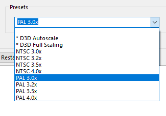
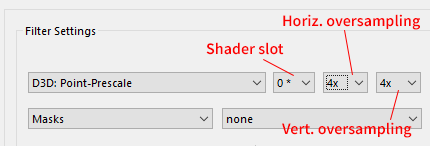



## Preamble

In this article series we're going to be looking at emulating the **Commodore
Amiga**, **Commodore 64**, and MS-DOS/early Windows era **IBM PC compatibles**
with period-correct graphics. What do I mean by "period-correctness"? It's
quite simple --- the emulated graphics should look as close as possible to the
output of CRT displays used with these computers back in the 80s and 90s. Now,
there's quite a bit of variance on the most typically used CRT technology per
platform, and these differences matter *a lot*, as it will demonstrated. The
below dream retro-setup showcases the perfect pairings for the aforementioned
computers (no, it's not mine, unfortunately):



  Left: a Commodore 64 paired with a small 13" colour TV. Middle: an Amiga 500
  hooked up to the venerable C= 1084 monitor (it's not period-correct if the
  front panel door is *not* broken off!). Right: an IBM PC compatible with a nice
  15" Trinitron display. This Norwegian dude ([UncleAwesome](https://www.youtube.com/channel/UC_Exbgz-zDrEEEaGZmbfA9Q)) certainly knows how to have a good time!
  ([source](https://www.amigalove.com/viewtopic.php?f=11&t=1593&p=10458&hilit=winter#p10458))



Of course, a small percentage of users who used their computers professionally
may have enjoyed bigger and higher quality displays even back then, but here
we're mainly focused on the experience of the typical home computer enthusiast
playing games (and watching a few demos now and then).

In case you're wondering, my "credentials" are having owned these wonderful
systems throughout the late 80s and 90s and caring deeply about them. I used
to spend far too many hours doing pixel graphics in [Deluxe
Paint](https://en.wikipedia.org/wiki/Deluxe_Paint) on my trusty Amiga 500, got
my feet wet with 3D through
[Imagine](https://en.wikipedia.org/wiki/Imagine_(3D_modeling_software)), and
produced
[countless](https://modarchive.org/index.php?request=view_artist_modules&query=82371)
[modules](https://amp.dascene.net/detail.php?detail=modules&view=2430) (songs)
in [ProTracker](https://en.wikipedia.org/wiki/ProTracker) and [FastTracker
II](https://en.wikipedia.org/wiki/FastTracker_2), so maybe I'm a bit more
attuned to the accurate emulation of the audiovisual idiosyncrasies of these
classic machines than the average user (or maybe not --- many people who "just
play games" can be very sensitive to these aspects as well). I've also done a
fair bit of VGA programming in assembly on my first 486 PC, so I'm not a
complete stranger to the low-level details of graphics programming either.

In any case, this is not about prescribing the "best" way of emulating these
computers to anybody. "Best" is highly subjective, you can do whatever, for
all I care, and it's not that some friendly agents from the Bureau of
Historically Accurate Retro-Computing will show up at your doorstep either if
you're not following this guide to the letter... However, if you're after
experiencing these systems just like people did back in the day (to the extent
current emulation technology allows it) --- whether as a die-hard fan of these
iconic machines, or as a newcomer who is interested in learning more about the
glory-days of home computing --- I would like to think you're in the right
place. In any case, I do hope you'll find this series a worthwhile and
interesting read.

Finally, while I've been trying to do my best at presenting technically and
historically accurate information in my writings, the more I researched the
topic, the more I realised how much depth and subtlety there is to it. I'm
sure that I had made a few mistakes here and there, and as there is far too
much misinformation circulating about emulating these systems on the Internet
already, if you've spotted any mistakes, factual or otherwise, I'd appreciate
if you'd let me know in the comments so I can make the necessary corrections.

But enough of this lengthy introduction, let's get to the best personal
computer of all human history --- the mighty Commodore Amiga!

</section>

## The Amiga

In the [Amiga](https://en.wikipedia.org/wiki/Amiga)'s heyday from the mid-80s
to early 90s, pretty much everybody who could afford it used their beloved
machine with the iconic [Commodore
1084S](https://dfarq.homeip.net/commodore-1084-monitor/) monitor or a [Philips
CM 8833](https://www.msx.org/wiki/Philips_CM_8833) (most 1084 models were
manufactured by Philips and thus used the same picture tube; they're
essentially identical monitors). Sure, there were other Commodore models, the
1084 itself had dozens of variations over the years and so had the Philips,
but they all shared the same [basic
characteristics](https://project64.c64.org/hw/1084s%20Monitor.txt): 

- 14" picture tube with a 13" diagonal viewable area
- slotted-triplet shadow mask (also known as slot mask, or [in-line shadow
mask](https://en.wikipedia.org/wiki/Shadow_mask#/media/File:CRT_pixel_array.jpg))
- 0.42 mm dot pitch
- 15,626 Hz line frequency
- 50/60 Hz image frequency
- 600-line vertical resolution
- composite and analog RGB inputs
{class="compact"}

Practically, they were *really* high-quality (for the time) and affordable
small TVs  with analog RGB inputs. As pairing the computer with one of these
monitors is arguably the most authentic classic Amiga experience[^monitors],
we'll be looking at emulating this particular display in
[WinUAE](https://www.winuae.net/), the premier Amiga emulator.



  "Amiga Demo" by the legendary [Jim
  Sachs](https://amiga.lychesis.net/artist/JimSachs.html) displayed in WinUAE
  with C= 1084S CRT emulation in correct NTSC aspect ratio.  (Click on the
  image for an enlarged version to appreciate the details)



[^monitors]: Yes, some people couldn't afford a monitor and hooked up their
  machine to a TV, but those were either small 13--14" TV sets, or if they
  used the big family TV, that had to be viewed from a distance, so the
  effective image dimensions ended up being about the same (remember, TVs in
  the 80s were *much* smaller than today). The [Sony PVM and
  BVM](http://arekuse.net/blog/tech-guides/bvm-pvm/) line of monitors seem to
  be very much in vogue lately in retro-gaming circles, especially in the US
  because of the almost total lack of small NTSC TVs with SCART inputs over
  there. I'm sure they're nice, but remember, the P and B stand for
  "Professional" and "Broadcast", respectively. A 20" BVM set you back by
  about 16,000 USD in the 90s, and the smaller models were not exactly cheap
  either, often costing well over a grand. Now how many home users exactly
  could have afforded these babies back in the day? Zero? I guarantee you that
  no Amiga enthusiast used a Sony PVM/BVM *ever* before the year 2000. It's
  just that companies started throwing them away or selling them for $5 apiece
  and the retro crowd quickly snatched them up, creating a small hype in the
  process — now they command absolutely ridiculous prices on eBay again. In
  any case, as using one of these is not the authentic experience (they're a
  bit too sharp, have aperture masks instead of slots masks, and the scanlines
  are a bit too prominent because of the increased vertical resolution of
  800--1000 lines), we're not concerned with them here. Another fun fact: as
  Commodore monitors had excellent image quality and colour reproduction for
  the time (for SD broadcast standards, that is), often they found their way
  into professional studios and were sitting next to the Sonys. You could buy
  several of them for the price of a single Sony; there's not much arguing
  with it that they had pretty much the best quality/affordability ratio
  throughout the 80s.

### Single vs double-scan

A significant number of people really dislike the idea of using any kind of
CRT emulation shader and prefer the look of sharp pixels. Well, I used to be
one of them so I know, and if we're talking about emulating 320&times;200 to
640&times;480 (S)VGA games, I would still 100% agree --- even the cheapest VGA
monitors used to be tack sharp, and they exhibited none of the various effects
typically associated with CRT shaders (prominent scanlines, halation, bloom,
etc.)

Moreover, 320&times;200 VGA was double-scanned at a line frequency of 31 kHz
(you can clearly see that on the blown up image below) so you could not notice
scanlines even on 15" or 17" displays from a normal viewing distance, neither
the effects of the shadow mask because of the very fine, typically 0.25-0.28
mm dot pitch. In any case, even 4k display wouldn't be able to convincingly
emulate the extremely subtle CRT effects of VGA monitors, so unless you have a
8k monitor, it's best to stick to sharp bilinear or integer scaling for DOS
and early Windows games. (And I would go even as far as saying that these
characteristics of PC monitors are not even worth emulating.)



  Real photo of a CRT monitor running Wing Commander at 320&times;200
  VGA resolution. Virtually all non-broken VGA monitors produced an image this
  sharp and artefact free.





  Blown up view of the same 320&times;200 VGA screen --- notice that the image
  is double-scanned; in reality, all VGA adapters actually output
  320&times;400, so every line was doubled!



The situation on the Amiga, however, is entirely different. As mentioned,
Commodore monitors were essentially small TVs, subject to SD TV standards. PAL
(NTSC) programmes display 50 (60) half-frames
([fields](https://en.wikipedia.org/wiki/Field_(video))) per second,
interlaced, at 576 (480) lines of vertical resolution. What this means is that
the display alternates between even and odd fields at 50 (60) Hz, and every
field only contains 288 (240) lines, stretched to fill the screen (there is
literally a 1-line vertical offset between the two alternating fields; this is
the cause of the infamous "interlace flicker"). Interlace is not that great
with mostly static computer generated images having sharp contours, so for
low-res they used the same trick as most consoles of the era: they simply just
sent the display either all-even or all-odd fields, rather than alternating
between even and odd. The result is a completely static 50 (60) FPS image ---
but the scanlines now only have half the "density" vertically, so to speak,
which is the main contributing factor for the famous "scanline" look.
Scanlines are much more noticeable on NTSC because of its ~17% reduced
vertical resolution compared to PAL, which causes the lines making up the
image to be placed further apart (incidentally, this explains why
scanline-fetishism seems to be more rampant in American retro-gaming circles
nowadays...)

The below photos of Commodore monitors displaying 320&times;200 low-res in NTSC
illustrate single-scanning very well (enlarge them to inspect the details).



  The Secret of Monkey Island, 320&times;200 NTSC ([source](https://www.reddit.com/r/crtgaming/comments/jdlr4h/monkey_island_on_a_1084s_in_60hz/))





  Winter scene, 320&times;200 NTSC, 16-colour palette ([source](https://www.amigalove.com/viewtopic.php?f=5&t=2069&p=13621&hilit=winter#p13621))



TODO pinball dreams

And this is a video recording of an NTSC Commodore monitor in action from
[AmigaLove](amigalove.com/) (you should watch it in fullscreen at 1080p to
appreciate the details).

  <iframe width="560" height="315" src="https://www.youtube.com/embed/b0sVz6hWO68?start=425" title="YouTube video player" frameborder="0" allow="accelerometer; autoplay; clipboard-write; encrypted-media; gyroscope; picture-in-picture" allowfullscreen></iframe>

At 320&times;256 PAL resolutions the pixels are more densely packed together
vertically, and although the scanline effect is weaker, it still subtly
contributes to the overall "textured" quality of the image:



  Shadow of the Beast, 320&times;256 PAL, [too many colours to count](https://codetapper.com/amiga/sprite-tricks/shadow-of-the-beast/) 



Essentially, all online flamewars about scanlines vs sharp pixels comes down
to which particular systems the people participating in the debate owned. Guys
whose first computer was a PC and grew up with VGA games can rightfully claim
that they never saw scanlines on their monitors, and the pixels appeared as
sharp, chunky little rectangles, while the Amiga and console folk were
definitely not hallucinating either when they keep talking about scanlines and
the beneficial smoothing effects of CRTs on low-res graphics.

### Why bother?

People are paying big money for powerful graphics cards these days to enjoy
their 3D games with smooth antialiased graphics --- back in the 80s we got that
smoothing for free in the monitor hardware! Of course, the graphics still had
to be skilfully made, but if it was properly antialiased by the artist, the
results just looked glorious on a typical Commodore monitor.

Below is an Amiga artwork with a CRT shader applied to it that simulates the
quintessential Commodore 1084S monitor (click on it for a larger version, and
click again if the cursor turns into a magnifier glass to have it displayed
with 1:1 pixel mapping). I'd bet that most people could not correctly guess
that this is in fact 320&times;256 / 64-colour pixel art (the actual image is
even smaller; it fits within a 274&times;216 rectangle). Subjectively, it
certainly looks higher resolution than that; there's an almost 640&times;480
SVGA quality to it.



  [Scarecrow](https://demozoo.org/graphics/67551/) by [Made](https://demozoo.org/sceners/131/) (320&times;256 / 64-colour Amiga AGA pixel art)

  The image was &times;3 upscaled with a CRT shader. Notice on the 200% view
  how the shader melts away all the blockiness, increases the perceived
  resolution, and adds subtle texture to the image. None of that is present in
  the straight &times;3 integer upscaled version. That's analog versus digital
  for you, in a nutshell (emulated analog, but still).



The gradients and the curves are super smooth, you can't see any jagged edges
and chunky pixels like you would on an objectively higher-quality VGA monitor
displaying the *exact same* image. But measurable improvements in technical
specifications don't necessarily always translate into better outcomes,
especially when human perception and something as subjective as art is
involved. For me personally, pixel art viewed on Commodore monitors from the
80s is pure magic, and that magic largely got lost during transitioning to the
technologically superior PC VGA monitors in the 90s. From 1985 to about 1995,
a generation of Amiga artists and enthusiast had been fixating their gazes
upon the flickering analog magic that was the Commodore 1084S, and that's
something I think is well worth understanding and preserving. And it's
just heaps of fun! Using WinUAE with an emulated 1084S puts me in a good mood
every time; although it's not perfect, it gets me a little closer to the
experience of sitting in front of a real Amiga. And how long until all
Commodore monitors finally die and end up in the junkyard? Clearly, emulation
is the only practical way going forward.

Having said all that, it's not all roses with analog CRTs. People fondly
remember the visually pleasing aspects of this display technology, but nobody
misses flicker, vignetting, geometric distortions of the non-flat
picture tubes, just to name the worst offenders. Naturally, we will not be
emulating any of these undesirable elements.

What we will be emulating, though, is the following:

- period-correct image dimensions and aspect ratio
- electron beam illuminating the phosphors on the screen (versus sharp
  rectangular pixels)
- scanlines (subtly different between PAL and NTSC)
- colour reproduction of the Philips CRT
- phosphor and shadow mask patterns
- bloom and glow
{class="compact"}

We won't be looking at emulating any temporal artefacts this time (e.g. motion
blur, afterglow, etc.) as WinUAE has no support for such effects currently.

Here is a fun example on how the shaders hold up to a real 1084S monitor. The
photos were taken from the [Eye of the Beholder
review](https://www.amigalove.com/games.php?game_id=13) published on
[AmigaLove](https://www.amigalove.com/). I highly recommend perusing this site
as it's one of the best online sources of good quality photos of Commodore
monitors, and of course the articles themselves are very well-written and
informative too. Needless to say, close-up photos of CRTs don't nearly tell
you the whole story, but I'm actually quite surprised to see the emulated
results to be this close to the real thing!



  Comparison of real C= 1084S monitor photos to the CRT emulation presented
  in this article and to raw bilinear sharp upscaling.




  
  Eye of the Beholder with CRT emulation in WinUAE (in correct NTSC aspect
  ratio, as the developers intended)



That's fine for low-res, but what about hi-res content? There's nothing more
annoying than quitting a game and having to switch the shader off because
it only supports low-res and makes the Workbench screen unreadable. If you're
like me, that would take you right out of your retro-computing bliss
in a jiffy! Fortunately, I have good news for you: Guest's shader supports
_all_ standard OCS resolutions and looks *glorious* in hi-res too!



  Workbench 1.3 in all its overscanned glory. Old school! If this doesn't get
  you excited, I don't know what will. This shader looks so good I want to
  include it in my will, I swear!



## A few quick words about human psychology

Just before we begin, it's worthwhile to point it out that your perception can
play tricks on you, so at the very least it's good to be aware of a few basic
psychological facts about human perception.

Firstly, we've been conditioned into thinking that *more*, *bigger*, *louder*,
*faster*, etc. always equals *better*. Some of this might be evolutionary,
some just a product of the times we live in, and maybe it's even true most of
the time, but not *always*. It's very easy to outright dismiss an experience
because it seems "inferior" according to some preconditioned criteria, but if
you keep an open mind and try to live with it for a while, you might start to
appreciate some of its not so obvious qualities (e.g. a "less sharp" image
could make gradients and dither appear smoother, gently melt away all the
jagged edges, and just subjectively it might seem more "cosy" --- not unlike
the certain magic of technologically inferior (strictly speaking) old analog
recordings versus the 100% perfect new digital releases).

Secondly, the "order of doing things" matters. Going from sharp to less sharp,
highly saturated to less colourful, louder to quieter, etc., always feels like
"losing something". But look away from your monitor for 10--20 seconds, then
look again at the "less sharp" image --- wow, now it seems quite normal!
Switch back to the 100% sharp version --- hmm, that's weird; now that seems
too clinical in comparison, and I'm not even so sure anymore that it's
"better"!

Like I said, I don't want to suggest you what to experience exactly (I
couldn't really do that, could I?); it's just good to be aware of these
mechanisms, otherwise they can be quite perplexing and could cause you to keep
chasing your tail, running around in circles, if you have no idea whatsoever
what's going on, psychologically speaking.

## Credits

The shaders presented in the article are the works of Guest, who originally
published them in the [English Amiga Board](https://eab.abime.net/) forums
(you can read the original discussion
[here](https://eab.abime.net/showthread.php?t=61776)). Since then he has made
his WinUAE shader pack available on
[GitHub](https://github.com/guestrr/WinUAE-Shaders). Apart from the emulation
of the Commodore A2080 monitor which I'm going use in this article,
the pack also contains a number of other interesting things, such as an
arcade CRT shader and a recreation of the Sony Trinitron displays.

Guest's current bleeding-edge shader related work can be followed in the
[this LibRetro forum thread](https://forums.libretro.com/t/new-crt-shader-from-guest-crt-guest-advanced-updates/25444).
Although only available for RetroArch/LibRetro at the moment, it's surely
worth checking out, and we can only hope his work will be eventually ported to
WinUAE in the future once it has support added for more advanced shading
techniques.

## Image dimensions

As explained above, the physical dimensions of an Amiga monitor were
effectively standardised, at least between about 1985--1995. This is important
because if you play games featuring low-res artwork (320&times;200 or
320&times;256) designed for 14" screens fullscreen on a 24" or larger monitor,
it will just look like crap --- everything will look too big and overly
blocky. The best way to experience those old games as their creators intended
is to match the physical dimensions of your emulated computer's image to that
of a 14" monitor. Eerily enough, with &times;3 integer scaling you will get
almost *exactly* that on a typical 24" LCD (just draw a 960&times;720
rectangle and measure its diagonal with a ruler; it will be the 13" which
equals the diagonal viewable area of the 1084S).

Now, WinUAE is the greatest Amiga emulator ever and I absolutely love it, but
the display settings require pilot training. Things are hunky-dory until all
you care about is stretching the image to fill the whole screen (just use
**Fullscreen (TV)** or **Fullscreen (Max)** scaling method in the **Filter**
section and set **Aspect Ratio Correction** to **Automatic**), but once you
want to set up exact scaling ratios and image dimensions, the UI is really not
on your side anymore, to put it politely. Long story short, after countless
hours of tinkering I stumbled upon the *One True Way&trade;* of getting
predictable results in the exact way I wanted, so that's what I will describe
below.

This is what your **Display** settings should look like. These are the
settings for PAL; of course, you could use NTSC as well, and you might want to
use windowed mode or a different vsync method. But the rest must be set
*exactly* as shown, and all the **Brightness**, **Contrast**, **Gamma**, etc.
settings must be at zero. Ticking the two centering checkboxes surely seems
enticing, but I recommend against it as it will lead to all sorts of problems
(we can always adjust the image position manually in the **Filter** settings
if we have to).



  WinUAE Display settings



Now the **Filter** settings; again, you must set up everything exactly as
shown. With these settings we'll have full manual control over the scaling
with the **Horiz. size** and **Vert. size** sliders. Unfortunately, the
numerical input boxes are read-only, so we must use the slider widgets to set
the values which is rather inexact and cumbersome. The only way for making
fine adjustments is with the cursor keys while the slider is in focus.

With our settings so far we're getting &times;2 scaling with both sliders at
0, so anything else will be on top of that. After some trial and error I
managed to reverse-engineer the magic formula: **(ScaleRatio -- 2) &times;
1000**. So if we want &times;3 scaling, we'll need to set **(3 -- 2) &times;
1000 = 1000** on both sliders.



  WinUAE Filter settings



Like I said, &times;3.0 will give us the authentic 1084s image size on a
typical 24" LCD monitor running at 1920&times;1080 resolution. But sometimes
we can deviate from that with good results --- for example, Pinball Dreams can
be enjoyable at &times;3.5 if you lean back a bit, and I like to play Rick
Dangerous at &times;3.2 or &times;3.5 because the game doesn't use the whole
screen. Some games benefit from a slightly larger image, some don't; you'll
need to experiment and use your judgement. In any case, keep in mind that
&times;3.0 scaling will give you the "canonical" image size that people were
looking at sitting in front of their monitors back in the day, so that should
always be your starting point.


  
  Properly anti-aliased graphics look fabulous at &times;3.5 scaling too. Who
  needs more than 32 colours?! (Artwork by
  [Ra/Sanity](https://demozoo.org/sceners/304/) from the Amiga 500 demo
  [Arte](https://demozoo.org/productions/5784/))



The following table lists some useful scaling values along with the resulting
image dimension in pixels and their equivalent CRT sizes when viewed on a
typical 24" / 1080p LCD:

<table>
  <caption>PAL image scaling ratios</caption>
  <tr>
    <th width="16%">Scale ratio</th>
    <th width="12%">Horiz. size</th>
    <th width="15%">Vert. size</th>
    <th width="12%">Width (px)</th>
    <th width="15%">Height (px)</th>
    <th width="29%">Equivalent CRT size (on 24" LCD)</th>
  </tr>
  <tr>
    <td>&times;3.0</td>
    <td>1000</td>
    <td>1000</td>
    <td>920</td>
    <td>768</td>
    <td>14" (13" viewable)</td>
  </tr>
  <tr>
    <td>&times;3.2</td>
    <td>1200</td>
    <td>1200</td>
    <td>1024</td>
    <td>819</td>
    <td>15" (13.8" viewable)</td>
  </tr>
  <tr>
    <td>&times;3.5</td>
    <td>1500</td>
    <td>1500</td>
    <td>1120</td>
    <td>896</td>
    <td>17" (15.5" viewable)</td>
  </tr>
  <tr>
    <td>&times;4.0</td>
    <td>2000</td>
    <td>2000</td>
    <td>1280</td>
    <td>1024</td>
    <td>19" (17.3" viewable)</td>
  </tr>
</table>

I recommend saving these settings as presets so you can conveniently switch
between them (loading them won't restart the emulated machine). They're not
saved into the standard configuration directory, they're probably just stored
in the registry, so I can't share them with you easily. (Don't worry about the
NTSC presets just yet, we'll get to them in the next section.)

As shown on the **Filter** screenshot above, if you only want the scaling but
don't care about the CRT shader (in which case you're quite wrong, of course,
but whatever 😎), you'll need to use the **Point-Prescale** shader in **slot
0** with both horizontal and vertical oversample factors set to **4x**.

This will give you sharp-bilinear like rescaling in low-res modes, but in
hi-res (640-pixel-wide modes) the results leave a lot to be desired. To fix
that, you'll really need to use the CRT shader.

## Aspect ratio

[This](https://www.amigalove.com/viewtopic.php?t=348)
[topic](https://www.amigalove.com/viewtopic.php?f=5&t=27)
[has](https://www.gamedeveloper.com/business/no-ms-dos-games-weren-t-widescreen-tips-on-correcting-aspect-ratio)
[been](https://www.youtube.com/watch?v=zvdNZpHZsO4&t=672s)
[discussed](https://www.youtube.com/watch?v=HSujirmsrzQ)
[to](https://www.youtube.com/watch?v=D5hiwB7lzk8)
[the](http://coppershade.org/articles/More!/Topics/Correct_Amiga_Aspect_Ratio/)
[death](https://forums.scummvm.org/viewtopic.php?t=14460)
[a](https://www.reddit.com/r/videogamescience/comments/77c0rp/video_game_history_is_being_distorted_and_how_to/)
[thousand](https://www.neogaf.com/threads/ms-dos-games-and-aspect-ratio.1108226/)
[times](https://www.youtube.com/watch?v=YvckyWxHAIw)... but far too many
people still get it routinely wrong. Why's that so, I really don't know as the
whole concept is not that difficult. Here's my stab at explaining it 
unambiguously with as few words as possible (but not less!)

### PAL vs NTSC

- Before about 2005, all commonly used consumer TVs and monitors were 
  **4:3 display aspect ratio**.

- On **PAL** Amigas, non-laced & non-overscanned low-res is **320&times;256**
  and the **pixels are square** (1:1 [pixel aspect
  ratio](https://en.wikipedia.org/wiki/Pixel_aspect_ratio)[^true-pal-aspect-ratio]).
  To display the 5:4 aspect ratio image (320:256 = 5:4) on a 4:3 [display
  aspect ratio
  ](https://en.wikipedia.org/wiki/Aspect_ratio_(image)#Distinctions) screen
  while keeping the pixels square, the image needs to be slightly
  [pillarboxed](https://en.wikipedia.org/wiki/Pillarbox) (it fills the screen
  vertically, but there are two very narrow black borders on the sides, as
  shown on the photo in [this
  article](http://coppershade.org/articles/More!/Topics/Correct_Amiga_Aspect_Ratio/)).[^pal-aspect]

[^true-pal-aspect-ratio]: Yes, I'm aware that the pixels are not completely square
  in PAL when the Amiga is hooked up to a TV, and the ["real PAL pixel aspect
  ratio"](https://eab.abime.net/showthread.php?t=50015) is not quite 1:1, but
  a tiny bit off vertically. The thing is, people adjusted their screen sizes
  with the stretch controls on their monitors to taste anyway (hopefully to
  the correct 1:1 ratio!), so this is largely irrelevant. Plus it's much
  better to emulate square pixels for practical reasons.

[^pal-aspect]: It's easy to derive this from the ratios: 4:3 display aspect
  ratio can be rewritten as 16:12, and the [store aspect
  ratio](https://en.wikipedia.org/wiki/Aspect_ratio_(image)#Distinctions) of
  320:256 = 5:4 as 15:12. Because the vertical ratios are identical, the image
  fills the screen vertically. However, the display is 16 units wide while the
  image width is only 15 units, so there will be black bars on the two sides.

- On **NTSC** Amigas, standard low-res is **320&times;200** (because NTSC has less
  vertical resolution). The image fills the screen completely and the **pixels
  are 20% taller than wide** (1:1.2 pixel aspect ratio[^true-ntsc-aspect-ratio]). This is commonly
  referred to as "NTSC-stretch" in the popular vernacular.[^ntsc-aspect]

[^true-ntsc-aspect-ratio]: Same story for as for PAL; the "theoretically
  correct" vertical stretch ratio is not quite 1.2, but close enough.

[^ntsc-aspect]: Divide the 320&times;200 NTSC pixel-grid size by ten and we
  get a 32:20 [storage aspect
  ratio](https://en.wikipedia.org/wiki/Aspect_ratio_(image)#Distinctions).
  Multiply the 4:3 display aspect ratio by 8 to arrive at the same width
  factor; that will give us a 32:24 display aspect ratio. The horizontal
  factors match, so the image fills the screen horizontally, but not
  vertically (because 24 > 20); for that we need to stretch the pixels
  vertically by a factor of 24/20 = 1.2. This is the same vertical stretch
  factor that must be applied to 320x200 VGA games so they display correctly
  on square pixel aspect ratio LCD monitors. (Of course, the deeper and true
  explanation lies in the workings of the NTSC broadcast standard and would
  require some  knowledge of analog electronics as well; however, for our
  purposes here this purely aspect ratio based derivation is sufficient.)

The same rationale applies to every other standard [Amiga screen
mode](https://amiga.lychesis.net/knowledge/ScreenModes.html) and their
overscanned variants. The most important thing to remember is that the
vertical stretch factor of NTSC screen modes is *always* 1.2 in relation to
their PAL counterparts, without exception.

It's nothing too controversial so far, is it? PAL users had square pixels,
NTSC users slightly tall ones, and the image always filled the screen on both
standards (not 100% on PAL as explained above, but close enough).

### American made games on PAL computers

Now, the complication comes from the fact that most NTSC games designed by
Americans, originally intended for the US market, were also made available in
PAL countries. As early Amigas with the [OCS
chipset](https://en.wikipedia.org/wiki/Original_Chip_Set) were not PAL/NTSC
switchable in software like later models that had the ["fat" ECS Agnus
](https://theamigamuseum.com/the-hardware/the-ocs-chipset/agnus/) or the even
later [AGA](https://theamigamuseum.com/the-hardware/the-aga-chipset/)
machines, these PAL conversions had to use PAL screen modes, which means the
original NTSC graphics only occupied the upper 320&times;200 area of a
320&times;256 PAL screen and the bottom 56 lines were left blank (assuming
low-res). As a result, the art appeared squashed vertically compared to the
NTSC originals on PAL machines (some people call this the "PAL-squash").

Now what you must understand is that *these games were made in America, by
Americans, on NTSC monitors* that stretched the 320&times;200 image to fill
the whole 4:3 screen. It's entirely possible that none of the artists who
worked on these games saw a PAL screen in their entire lives! Therefore
(whether like it or not) *everybody on PAL systems experienced these games
incorrectly with the wrong aspect ratio back in the day* ("PAL-squashed"), not
as the original artists intended! (Including me, because I grew up in Europe
--- I'm not an American preaching to everybody that "Europeans got it all
wrong" or something... I'm just simply stating historical facts.)

Let this sink in a bit.

You must understand that the *only* reason for this rather precarious
situation is the technical differences between PAL and NTSC, and the fact that
drawing the art twice for both systems would have been prohibitively
expensive, so no wonder no company had ever done that.

Now, some people from PAL countries might concur that they only ever
experienced these games with squashed art and potentially running 17% slower;
that's how they remember them, and that's what they want to emulate for
nostalgic reasons. It's hard to argue with that logic; if those are your
memories, then that's the end of it. But keep in mind the "PAL-squash" only
happened because of practical considerations (mostly budgetary limitations);
it wasn't a deliberate artistic or creative intention, but an unfortunate
necessity. The question then really is this: do you want to emulate these
games how you remember them, or how their creators intended them to be
experienced? And wouldn't it be nice after all these years to finally enjoy
them in their most authentic, undistorted form?

### It's not just about the video

Many of these PAL conversions were less than perfect and did not account for
the ~17% slowdown that happens when a game synced to the 60 Hz NTSC vertical
refresh rate is run on 50 Hz PAL. Quite often the music playback was synced to
the screen refresh rate as well, which makes the slowdown fairly easy to spot
(if the game also has a DOS port, one of the surest ways to ascertain the
correct music playback speed is to listen to the DOS version).

Check out this video for a demonstration of the PAL vs NTSC differences on the
classic game Secret of Monkey Island. (By the way, it's worth watching the
entire video from the beginning, it's very informative and enlightening, but
at the very least just watch this little snippet.)

  <iframe width="560" height="315" src="https://www.youtube.com/embed/CYiBDVw_lzA?start=886" title="YouTube video player" frameborder="0" allow="accelerometer; autoplay; clipboard-write; encrypted-media; gyroscope; picture-in-picture" allowfullscreen></iframe>

To cite a few examples of my own, the music plays noticeably slower in the
following games when run in PAL mode (tested with the WHDLoad versions). In
NTSC mode, the music speed perfectly matches that of the DOS versions.

- Eye of the Beholder I-II
- Indiana Jones and the Last Crusade
- Pool of Radiance
- King's Quest 2
- Space Quest 3 *(probably all Sierra games are affected)*
{class="compact"}

These are better ports that seem to handle both PAL and NTSC correctly; there
is no difference in gameplay or music playback speed in the following titles:

- Curse of the Azure Bonds
- Loom
- Phantasie 1
- Pirates!
- Secret of Monkey Island
- Secret of the Silver Blades
- Windwalker
{class="compact"}

The moral of the story is that generally you can't go wrong by using NTSC mode
for *all* American titles (which includes a significant part of the whole
Amiga catalogue). Without doubt, that's the preferable option; the graphics
will appear undistorted, exactly as the creators intended, and the game will
run at the correct speed, including music playback. (Theoretically, the only
time you can run into problems is when you use a PAL crack of an NTSC game
that somehow broke NTSC compatibility.)

### Running games in NTSC

Sadly enough, as Amiga software preservation efforts seem to be almost
exclusively focused on PAL releases for whatever reasons, disk images of NTSC
originals are extremely hard to come by. But simply forcing NTSC mode on the
PAL versions widely available online should do the trick in most cases.

These are the two best ways to do that when using emulation:

- For WHDLoad conversions, forcing a game to run in NTSC mode is as simple as
  adding the `NTSC` tooltype to its launch icon. This will work fine on a
  typical emulated PAL Amiga 1200 setup; the game will open an NTSC screen and
  WinUAE will automatically apply the correct vertical aspect scaling ratio
  *on top* of our manually set &times;3.0-4.0 scaling. That's good news
  because we can keep using our scaling presets set up for PAL resolutions.
  This method requires the NTSC monitor driver to be installed --- just drag
  the NTSC icon from the `Monitors` directory on the **Storage** Workbench
  installer disk to ``Devs/Monitors`` on your system drive, reboot, and Bob's
  your uncle!

- If you plan on playing games on an OCS Amiga 500 with Kickstart 1.2/1.3,
  you'll need to emulate an actual NTSC chipset. It's very simple: just tick
  **NTSC** in the **Chipset** configuration section. Now, if you turn on
  automatic aspect ratio management in WinUAE (in the **Filter** section
  select **Fullscreen (TV)** or **Fullscreen (Max)** scaling and set **Aspect
  Ratio Correction** to **Automatic**), WinUAE will apply the correct aspect
  ratio correction right from the boot screen. But this only works if you're
  happy with the image being automatically stretched to fill the whole
  display. If we want to keep using our exact scaling methods, the automatic
  aspect ratio correction won't work, so we'll need to apply the NTSC-stretch
  ourselves in our scaler setup as shown below:

<table>
  <caption>NTSC image scaling ratios</caption>
  <tr>
    <th width="16%">Scale ratio</th>
    <th width="12%">Horiz. size</th>
    <th width="15%">Vert. size</th>
    <th width="12%">Width (px)</th>
    <th width="15%">Height (px)</th>
    <th width="29%">Equivalent CRT size (on 24" LCD)</th>
  </tr>
  <tr>
    <td>&times;3.0</td>
    <td>1000</td>
    <td>1600</td>
    <td>920</td>
    <td>720</td>
    <td>14" (13" viewable)</td>
  </tr>
  <tr>
    <td>&times;3.2</td>
    <td>1200</td>
    <td>1840</td>
    <td>1024</td>
    <td>768</td>
    <td>15" (13.8" viewable)</td>
  </tr>
  <tr>
    <td>&times;3.5</td>
    <td>1500</td>
    <td>2200</td>
    <td>1120</td>
    <td>840</td>
    <td>17" (15.5" viewable)</td>
  </tr>
  <tr>
    <td>&times;4.0</td>
    <td>2000</td>
    <td>2800</td>
    <td>1280</td>
    <td>960</td>
    <td>19" (17.3" viewable)</td>
  </tr>
</table>

Like mentioned before, I recommend creating presets for these settings so you
can easily switch between them at will:



If you have vsync enabled, your screen refresh rate *must* be 50 Hz for PAL
and 60 Hz for NTSC, respectively, otherwise you'll be experiencing all sorts
of weird speed issues (e.g. music playing much slower or faster than it
should). With vsync off this it not an issue, so that's a good quick way to
examine how a WHDLoad game behaves in PAL vs NTSC without having to change the
screen refresh rate and restart the emulator.



### But life ain't simple

No, we can't put this whole PAL vs NTSC fiasco behind us just yet... The
situation with European made games is a bit more complicated. The complete
algorithm for determining whether a particular title should be played in PAL or
NTSC is as follows:

* **Games originally developed by American studios --- always use NTSC**

   It does not matter if the Amiga port or the PAL version was done by a
   European developer; in virtually all cases they just reused the original
   NTSC graphics and quite often didn't even attempt to address the 17%
   slowdown issue.

   *Some well-known American studios: Activision, Accolade, Electronic Arts,
   Westwood, Origin, Interplay, FTL, MicroProse / MPS Labs, SSI,
   Lucasfilm Games / LucasArts, Sierra, Cinemaware, New World Computing,
   Sir-Tech, Infocom, Access Software, Electric Dreams, Spectrum Holobyte,
   Epyx, D.S.I., U.S. Gold, Broderbund, Capcom, SEGA*

* **Games originally developed by European studios (mostly UK)**:

    *  If the game uses **320&times;256** or some other PAL screen mode and the
       graphics fills the whole screen --- **always use PAL**

    *  If the graphics only takes up a **320&times;200** or smaller area of
       the screen, it does not automatically mean that it needs the
       NTSC-stretch applied to look correct; it might very well have been
       drawn with square pixels in mind.
       [Perihelion](https://hol.abime.net/1029) is a good example of this: the
       graphics is 320&times;200, but it absolutely needs square pixels
       (probably they just wanted to play it safe for an eventual future US
       release).

       Another interesting case is [Elvira 1](https://hol.abime.net/2836): the
       graphics actually look good in either PAL or NTSC. Most likely they
       anticipated the game to be released both in Europe and the US, plus
       they released the DOS and Amiga versions simultaneously, so apparently
       they tried to draw the art in a way that looks good in both aspect
       ratios (with quite good results, I have to say). In case of Elvira, I
       think it's really a toss-up. Anyway, you see the pattern here: you'll
       need to research the game a bit and, in some cases, use your aesthetic
       judgement.

   *A few important European studios: Bitmap Brothers, Psygnosis, Bullfrog,
   Horror Soft / Adventure Soft, Magnetic Scrolls, Delphine, Coktel Vision,
   Revolution, Ubisoft, Infogrames, DMA Design, Core Design, Level 9, Team 17,
   Sensible Software, Firebird, Digital Illusions, Silmarils, Thalion,
   Thalamus, Ocean*



Although looking at circles and squares to determine the intended aspect ratio
helps in many cases, it's not a 100% fool-proof method. It's certainly a good
method for most racing games and flight simulators where the circular dials
usually appear as perfect circles when the correct aspect ratio is being used,
but in general it's better to look at some common objects and make sure they
look correct, neither too tall nor too squashed (human faces and full human
figures are the best candidates for this).



## CRT shader

Congratulations, if you've made it so far, the display of your emulated Amiga
should resemble that of a PC VGA monitor in low-res mode (sharp blocky pixels
and all). But unlike VGA, which is double-scanned at 31 kHz horizontal sync
frequency, all stock Amigas output 15 kHz single-scanned video signals, and
not even the best Commodore monitors could enter the ring against any average
14" VGA display from the 90s when it comes to sharpness (unsurprisingly, since
the IBM PC was originally intended as a business machine, therefore text
legibility was of primary concern).

In order to simulate the roundish "pixels" of the 1084S that slightly blend
into each other (the rather nice "natural anti-aliasing" effect that makes
low-res artwork so much more pleasant to look at, and lends the image this
wonderful "fuzzy analog quality") and the subtle scanlines (at least on PAL;
on NTSC they're much more prominent), we'll need Guest's rather excellent
**CRT-A2080-HiRes-SmartRes-Interlace** CRT shader. Clearly, this shader is the
star of the show, and this makes the biggest difference after matching the
physical dimensions of the 1084S monitor. One its most remarkable features is
that it provides seamless support for all standard Amiga screen modes in a
*single* shader (320&times;256 Low Res, 640&times;256 High Res, 320&times;512
Low Res Laced, 640&times;512 High Res Laced, and naturally all their
overscanned and NTSC variants). The interlace flicker is not emulated, but
probably that's for the best. This thing handles everything you throw at it,
including low-res/hi-res split-screen games (e.g Lemmings, Shadow of the
Beast, Apidya, Agony, all Magnetic Scrolls adventures, etc.)



  Start scene of [Scapeghost](https://hol.abime.net/1841) by [Magnetic
  Scrolls](https://en.wikipedia.org/wiki/Magnetic_Scrolls). Upper half of the
  screen displaying the graphics is 320&times;256 low-res, while the bottom
  half with the text is 640&times;256 hi-res. As you can see,
  **CRT-A2080-HiRes-SmartRes-Interlace** handles situations like this
  splendidly!



I have tweaked the shader settings a little bit, you can download my
customised versions from here. They're called **CRT-A2080-PAL-\*** and
**CRT-A2080-NTSC-\*** and have several variants --- I had to create copies
because WinUAE doesn't support shader presets yet, plus I made the name a
little shorter. The NTSC variants push scanline strength to the max without
much noticeable aliasing for the scaling factor indicated in the name, so for
example for &times;3.5 scaling you can safely use **CRT-A2080-NTSC-x3.5** or
the **x3.2** or **x3.0** variants for less strong scanlines. I created these
because NTSC users seem to have a fondness for scanlines and want them to be
displayed prominently. But you can just stick with the PAL preset if you
prefer to keep them subtle (that's what I do most of the time). The special
**PAL-sharp** preset is designed for text adventures to maximise text
readability.

By the way, in case you're wondering, "the Commodore A2080 was essentially a
high persistence phosphor model of the 1084 to reduce flicker in NTSC modes",
according to the [Big Book of Amiga
Hardware](https://bigbookofamigahardware.com/bboah/product.aspx?id=864).

Okay, so this is how to set it up:

In the **Miscellaneous** section, select **Direct3D 11** for the **Graphics
API** (and leave it at hardware accelerated, of course). Put the tweaked
version of these shaders into ``plugins\filtershaders\direct3d`` in your
WinUAE installation directory and restart WinUAE. Then in the **Filter**
section select **CRT-A2080-PAL** in slot 0, and set 2x horizontal and 4x
vertical oversampling. If your have a slower GPU and you're getting dropouts,
you might want to reduce this a little, but don't go below 2x vertical
oversampling (this is important to make the scanlines nice even and
aliasing-free). Oversampling takes a big hit on performance, e.g. with 2x
horizontal and 4x vertical oversampling your GPU would need to render
2&times;4=8 times as many frames per second!





Detail view of the NTSC x3.0 variant in action on a scene from Defender of the
Crown:


  
  Left: sharp-bilinear scaling (NTSC aspect ratio corrected) 
  Right: **CRT-A2080-NTSC-x3.0** shader



## CRT colour profile

The next thing that makes a huge difference in replicating an authentic CRT
experience is emulating the colour profile of the C= 1084S monitor. Most
modern displays are calibrated for [sRGB](https://en.wikipedia.org/wiki/SRGB)
out-of-the-box that uses [D65](https://en.wikipedia.org/wiki/Illuminant_D65)
(6500K) whitepoint. This is noticeably cooler (bluer) looking than the
more warmish/yellowish look of a typical CRT from the 80s, which was closer to
5000K (CRT manufacturers more or less just did whatever they felt like back
then; the sRGB standard came into existence in 1996 precisely to remedy this
Wild West type of situation).

Guest's [WinUAE shader pack](https://github.com/guestrr/WinUAE-Shaders)
contains a CRT colour profile filter in ReShade format
([ReshadeShaders/WinUaeColor.fx](https://github.com/guestrr/WinUAE-Shaders/blob/master/ReshadeShaders/WinUaeColor.fx)),
and one of the included profiles is exactly what we need (information about
the different profiles can be found
[here](https://github.com/guestrr/Libretro-Retroarch-SLANG/blob/main/crt-guest-dr-venom2/shaders/guest/README#L242-L360=)):

> **[Profile 4]** Manually calibrated and compared to real Philips based CRT
> monitors, running side by side with the shader on a 10-bit DCI-P3 gamut
> panel. This calibrated CRT profile covers amongst others Philips CM8533,
> Philips VS-0080, and Commodore 1084. 
>
> Note the whitepoint is significantly different from D65. It's closer to
> 6100K, but clearly not on the blackbody curve.

Perfect! You'll need to install [ReShade](https://reshade.me/) into your
WinUAE folder to use this, just follow Guest's instructions from the
[README](https://github.com/guestrr/WinUAE-Shaders/blob/master/README.md). Now
one thing that he doesn't mention is that the shaders depend on the common
**ReShade.fxh** and **ReShadeUI.fxh** files that are not included, so just get
them from [here](https://github.com/crosire/reshade-shaders/tree/slim/Shaders)
(all these files are included in my pack, by the way).

Once you've set up everything correctly, just enable **WinUaeColor.fx** and
set it up like shown below. **Color Profile 4** is the Philips, most people
should leave **Color Space** at 0 (sRGB), but if you're the lucky owner of a
wide-gamut display then you definitely should set it so it matches your
displays colour profile (the emulation would be more accurate that way,
according to the instructions).

**Colour Temperature** should stay at zero, and I know it's very tempting, but
don't ever touch **Color Saturation** because it's completely broken. The
default saturation is just fine, but if want to have a saturation control, I
recommend prod80's [Color Space
Curves](https://github.com/prod80/prod80-ReShade-Repository/blob/master/Shaders/PD80_03_Color_Space_Curves.fx)
ReShade filter in `L*a*b` mode, placed *before* the **WinUaeColor** shader.

The **Color Contrast** adjustment, on the other hand, works quite well; you
can either leave it at zero, but lately I prefer to bump it up a little to
around 0.5. Some games look quite nice with the contrast cranked up almost to
the max, some look completely fine at zero --- just like on real 
hardware.




As expected, the right half of the below example image with the Philips colour
profile applied looks much more warm and cosy. This is how I remember my
Philips and Commodore monitors, the raw sRGB version looks too harsh and
clinical in comparison.



  Left: scene from Centurion by Jim Sachs, sRGB colours 
  Right: same image with Philips colour profile applied



The difference is even more apparent on greys, like on this Directory Opus
screenshot:



  Left: Directory Opus, sRGB colours 
  Right: same image with Philips colour profile applied



## Phosphor and shadow mask

Now, this step is subtle but important: the emulation of the phosphor pattern
and the shadow mask that gives the image a subtle, almost canvas-like texture.
Different monitors use different types of [shadow
masks](https://en.wikipedia.org/wiki/Shadow_mask); the 1084S and most early
computer monitors have the slot-mask or in-line type which was also very
commonly used in TV CRTs in the 80s.



  Left: slotted-triplet shadow mask (also known as slot mask, or [in-line shadow
mask](https://en.wikipedia.org/wiki/Shadow_mask#/media/File:CRT_pixel_array.jpg)) 
  Right:  triad-style dot mask typically used in PC monitors 
 ([source](https://en.wikipedia.org/wiki/Shadow_mask))



The staggered slot mask pattern combined with the relatively low dot pitch
(0.42 mm) results in quite visible zig-zag patterns across the scanlines. The
effect is especially noticeable in NTSC as you can see in many of
[AmigaLove](https://amigalove.com/)'s YouTube videos.



  Close-up view of the effects of the slot mask --- Workbench ([source](https://www.youtube.com/watch?v=b0sVz6hWO68))





  Close-up view of the effects of the slot mask --- Pools of Darkness ([source](https://www.youtube.com/watch?v=b0sVz6hWO68))



Like I said in the beginning, these settings are really tailored for 1080p. At
4k or higher you'll most likely need to make significant adjustments to it.
[This article](https://filthypants.blogspot.com/2020/02/crt-shader-masks.html)
gives a good succinct explanation on how these pixel-masks are implemented.

Again, this is not something that jumps at you as it's rather subtle, but it's
missing if it's not there. The lack of it is especially noticeable on large
solidly coloured areas; on a real CRT these were never *really* solid, there
was always something "going on" even in these boring surfaces --- a faint,
almost subliminal canvas-like texture. Here are the settings I'm using in the
**WinUaeMaskGlow** ReShade filter (whether you put it before or after the
colour filter is of not much practical difference):




And this is a before/after comparison on a blow-up NTSC image. Doesn't seem
like a big deal; it's one of those strange things that doesn't seem to add
much when you turn it on, only when you *remove* it once you've become
accustomed to it. It might even seem a bit pointless first, but trust me, just
set it up, live with it for a while, and then turn it off --- chances are
you'll really miss it!



  Left: no phosphor and shadow mask emulation 
  Right: phosphor and shadow mask emulation applied 



## Bloom and glow

Okay, this is really the icing on the cake, a subtle but important final touch
to make the emulation even more authentic. CRT displays always exhibit a
certain degree of halation, which is quite an interesting effect. As the
electron beams illuminate the phosphors and they emit light in turn, the light
rays entering the front glass close to normal angles pass mostly undeterred,
but below a certain angle of incidence the light is reflected back to the
picture tube's surface where it undergoes further reflections. The end result
is a characteristic concentric glow ("halo") around brightly lit areas, which
also results in a localised loss of contrast. The effect is most noticeable
when bright text is displayed on a black background, as shown on the example
below.

The "bloom" effect is maybe not named entirely correctly, but it's basically
the effect of brighter pixels appearing a little larger and bleeding into
their neighbouring pixels a bit more. Sort of a pixel-level, small scale glow
effect that incidentally is also useful to make up for the brightness loss
caused by the shadow mask.

Luckily for us, the mask and glow shader emulates both phenomena quite
convincingly. The trick is not to overdo it (you shouldn't really notice the
effect unless you're looking for it), so I'm keeping both at a rather low
strength setting. What I said about the phosphor and shadow mask emulation is
stands for these as well: turning them on might not seem overly impressive
first (if you're impressed, you've added *waaaaaay* too much glow!), but when
you turn them *off* later, you'll really miss the effects.



  Left: Eye of the Beholder intro, glow &amp; bloom emulation off 
  Right: Same image with subtle glow &amp; bloom emulation



<section class="links">

## Links, files & further reading

### Guest's shaders

* [Latest version of the WinUAE shader pack](https://github.com/guestrr/WinUAE-Shaders)
* [Original releases and discussion](https://eab.abime.net/showthread.php?t=61776)
* [Guest's new bleeding-edge CRT shaders](https://forums.libretro.com/t/new-crt-shader-from-guest-crt-guest-advanced-updates/25444)

</section>
